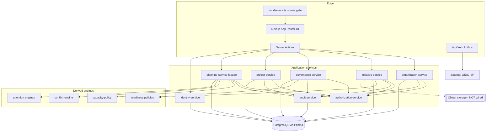

# Project / Portfolio Management Platform — AS-IS Implementation Audit

**Repository:** [Jonassan1990/ManagmentPlatform](https://github.com/Jonassan1990/ManagmentPlatform)  
**Audited commit:** `0f991df` (merge of PR #9 — Phase 6 production auth) on `main`  
**Audit date:** 2026-10-08  
**Audit type:** Read-only repository inspection (no code, schema, or dependency changes)  
**Deployed app (external):** `https://managmentplatform.vercel.app` — login observed failing with server error at audit time; docs state production deploy blocked without OIDC + managed Postgres  

---

## Management snapshot

| Perspective | Estimate |
|---|---|
| **Estimated overall functional completion (vs full product vision)** | **58%** |
| **Estimated completion vs documented MVP vertical slice** | **78%** |
| Core foundation (org, authZ skeleton, modular services, audit writes) | **72%** |
| Initiative lifecycle (Demand → Requirements → Pre-study) | **82%** |
| Governance & decision gates | **80%** |
| PoC / Pilot | **74%** |
| Project delivery | **55%** |
| PI Planning | **70%** |
| Resource / capacity planning | **68%** |
| Portfolio / executive views | **42%** |
| Production readiness | **28%** |

**Scoring method (summary):** Weighted against the product vision in `docs/PRODUCT-VISION.md` and MVP slice in `docs/MVP-ROADMAP.md`. Counts pages/schema alone as low weight; requires traced UI → Server Action → application service → Prisma mutation → authorization → audit (where claimed). Mock/hardcoded business data was **not** found as a runtime pattern; incompleteness is mostly deferred product depth and production ops, not fake dashboards. Percentages are intentionally conservative.

---

## 1. Executive Summary

This repository is a **substantial modular-monolith Next.js application** implementing Phases 1–6 of a documented Management & PI Planning Platform. It is **not** a UI mock or spreadsheet prototype. The durable domain model in `prisma/schema.prisma` and large application services (notably `governance-service.ts` ~2.6k LOC, `initiative-service.ts` ~1.3k LOC) implement a governed initiative lifecycle with real persistence, readiness policies, immutable approvals/decisions, PoC/Pilot evaluation, project conversion with traceability, and hours-based PI planning with capacity, conflicts, dependencies, and baselines.

**What is genuinely strong today (with DEV auth + Postgres):**

- Organization hierarchy and resources with membership capacity shares  
- Initiative Demand → Requirements → Pre-study with enforced advancement  
- Governance gates, evidence packages, approval records, decision records (GO / CONDITIONAL_GO / NO_GO / SCALE / …)  
- PoC and Pilot as first-class entities with criteria evaluation  
- Idempotent Initiative → Project conversion preserving history  
- PI Planning board (HTML5 drag-and-drop + forms), capacity math, derived conflicts, immutable baselines  
- Server-side RBAC via `assertCan` on mutations (~97 call sites)  
- Structured audit event writes (~73 `audit.record` call sites)  
- Unit + integration tests (~5.6k LOC tests) and smoke/acceptance scripts  

**What is not genuinely finished:**

- Production SSO/DB credentials not wired; live Vercel login fails/blocked  
- Binary file storage deferred (`storagePointer` only)  
- No notifications, no discussion/comment threads, no Issue entity  
- Business ownership mostly free-text names, not Principal/Resource FKs  
- No role-administration UI; `ROLE_MANAGE` / `AUDIT_READ` largely unused for product UX  
- Dependencies limited to Work Item ↔ Work Item and Project ↔ Project (not Initiative/Team/Milestone)  
- Portfolio is an attention Overview, not a full portfolio analytics product  
- Principal ≠ Resource; login identity is not automatically a capacity-bearing person  

**Bottom line:** Against the **documented MVP vertical slice**, the product is largely walkable end-to-end in a local DEV environment. Against the **full enterprise vision** (portfolio cockpit, notifications, attachments, richer delivery/issue management, production ops), roughly **half to three-fifths** of intended capability exists as real software.

---

## 2. Overall Completion Score

| Layer | % | Rationale |
|---|---:|---|
| UI completion | **65%** | Broad route coverage for org, initiative stages, governance, PI; gaps in role admin, audit viewer, risk update UX, portfolio depth, binary docs |
| Backend completion | **72%** | Application services + Server Actions cover MVP domains; only Auth.js REST route; no external integrations/jobs |
| Database/domain completion | **75%** | Rich Prisma model through Phase 5/6; missing Issue/Comment/Notification/object storage; some free-text ownership |
| Business logic completion | **70%** | Strong readiness, gates, capacity, conflicts; no controlled stage-skip; PLATFORM scope broad; assignee workflow unused |
| PI Planning completion | **70%** | PI/iterations/allocations/capacity/deps/baseline real; Scenario A/B foundation only; DnD is HTML5 not polished kit |
| Resource/Capacity completion | **68%** | Real hours math + overload; leave via availability override only; no HR sync; Principal not linked to Resource |
| Governance completion | **80%** | Gates, snapshots, approvals, decisions, conditions, policy versioning — mature for MVP |
| Testing/QA completion | **55%** | Strong unit/integration for policies & domains; smoke scripts; no browser E2E CI suite observed |
| Production readiness | **28%** | Auth code ready; deploy docs say blocked; live `/login` server error; no managed prod evidence in repo |
| **Overall functional product** | **58%** | Vision-weighted (lifecycle+governance+planning heavy); MVP-weighted would be ~78% |

---

## 3. What Exists Today

### 3.1 Stack (verified)

| Layer | Technology | Evidence |
|---|---|---|
| Frontend | Next.js 16 App Router, React 19, Tailwind 4 | `package.json`, `src/app/**`, `src/components/**` |
| Mutations | Next.js Server Actions (primary API) | `src/app/actions/*.ts` |
| HTTP API | Auth.js only | `src/app/api/auth/[...nextauth]/route.ts` |
| Domain | Modular monolith under `src/modules/*` | organization, initiative, governance, project, pi-planning, identity-access, audit, shared |
| ORM / DB | Prisma 6 + PostgreSQL | `prisma/schema.prisma`, `docker-compose.yml` |
| AuthN | Auth.js v5 OIDC + DEV bridge | `src/server/auth.ts`, `src/middleware.ts` |
| AuthZ | Permission strings + RoleBinding scopes | `src/modules/shared/permissions.ts`, `authorization-service.ts` |
| Validation | Zod | module `schemas.ts` files |
| Tests | Vitest unit + integration | `tests/**`, `vitest*.config.ts` |
| Deploy | Vercel config | `vercel.json`, `docs/DEPLOYMENT-VERCEL.md` |

### 3.2 Implemented phase history (docs + migrations)

| Phase | Intent | Migration |
|---|---|---|
| 0 | Product docs / vision | `docs/*` (no app) |
| 1 | Organization foundation | `20260923090055_phase1_organization_foundation` |
| 2 | Initiative / Demand / Requirements / Pre-study | `20260923093444_phase2_initiative_prestudy` |
| 3 | Governance / Approvals / Decisions / PoC | `20260923100000_phase3_governance_poc` |
| 4 | Pilot / Project | `20260923110000_phase4_pilot_project` |
| 5 | PI Planning | `20260923120000_phase5_pi_planning` |
| 6 | Production OIDC + bootstrap | `20260923130000_phase6_production_auth` |

### 3.3 UI surface (routes)

Shell nav (from UX report + layout): Overview · Organization · Initiatives · Approvals · Decisions · PI Planning · Governance policy.

| Area | Routes |
|---|---|
| Home / attention | `/` |
| Auth / setup | `/login`, `/setup/bootstrap`, `/access-not-configured` |
| Organization | `/organization`, `/organization/setup`, hierarchy + resources + governance-policy |
| Initiatives | `/initiatives`, `/initiatives/new`, workspace tabs: demand, requirements, pre-study, governance, poc, pilot, project, risks, documents, decisions, history |
| Approvals / Decisions | `/approvals`, `/decisions` |
| PI | `/pi`, `/pi/new`, `/pi/[piId]` + board, capacity, dependencies, review, baseline, settings |

### 3.4 Classification legend used below

| Symbol | Meaning |
|---|---|
| 🟢 COMPLETE | Usable end-to-end for MVP intent with real persistence + rules |
| 🟡 MOSTLY IMPLEMENTED | Core path works; meaningful gaps remain |
| 🟠 PARTIAL | Real pieces exist but not a finished capability |
| 🔴 NOT IMPLEMENTED | No meaningful product path |
| ⚫ PLACEHOLDER / MOCK | Schema/UI stub or intentional deferral without runtime depth |
| 💥 IMPLEMENTED BUT BROKEN | Wired but inconsistent/failing |

---

## 4. Architecture Map



**Architectural style:** Modular monolith (matches `docs/ARCHITECTURE.md`). Domain mutations go through services with `assertCan` + Prisma transactions; UI is not the only conceptual entry, but **there is no public REST/OpenAPI surface** beyond Auth.js.

**Missing architecture pieces vs vision:** object storage port, notification channels, background jobs, event bus, reporting read-model warehouse, Excel import pipeline (`docs/EXCEL-MIGRATION.md` — future).

---

## 5. Domain / Data Model Assessment

### 5.1 Strengths

- **Initiative as lifecycle root** with stage data (Demand, Requirements, PreStudy, PoC, Pilot, Project) rather than disconnected apps — ADR-003 reflected in schema.  
- **Governance immutability:** `ReviewSnapshot` JSON freeze, `ApprovalRecord`, `DecisionRecord` with supersession — ADR-005/006.  
- **Traceability:** `Project.initiativeId` unique; PoC/Pilot unique per initiative; `LifecycleTransition` history; project `getTraceability`.  
- **PI design discipline:** allocations reference `ProjectWorkItem` (no copy); capacity unit = hours; baselines immutable JSON; conflicts derived on read.  
- **Identity vs capacity separation:** `Principal` ≠ `Resource` (explicit schema comments) — correct for auth vs planning, but creates UX gap.

### 5.2 Weaknesses / risks

| Risk | Evidence |
|---|---|
| Free-text ownership everywhere business-facing | `requesterName`, `businessOwnerName`, `ownerName` fields — not Principal/Resource FKs |
| Approval assignee unused | `ApprovalRequest.assignedPrincipalId` exists; submit path permission-based inbox |
| Documents without blobs | `DocumentVersion.storagePointer` nullable; UI states binary deferred |
| Dependency subject types narrow | `DependencySubjectType` = `WORK_ITEM` \| `PROJECT` only |
| No Issue / Comment / Notification models | Absent from schema |
| PLATFORM scope breadth | Bootstrap/admin roles grant nearly all permissions; fine-grained SECTION/DEPT/TEAM scoping underused in product UX |
| Cost type inconsistency | PoC/alternative costs as `String`; Pilot/Project as `Decimal` |
| Stage enum compressed | `InitiativeStage` has DEMAND…PROJECT — PoC Evaluation / Scale Decision are **gate/decision outcomes**, not separate stage enums (acceptable if documented; easy to misread as missing stages) |
| Audit write-only | `AuditEvent` persisted; no product UI/API to consume `AUDIT_READ` |

### 5.3 Entity relationship (condensed)

```text
Organization
  ├─ Section → Department → Team → ResourceMembership → Resource
  ├─ Initiative (department-scoped)
  │    ├─ Demand (1:1)
  │    ├─ Requirement* → AcceptanceCriterion*, RequirementRelation*
  │    ├─ PreStudy → Assessment*, SolutionAlternative*
  │    ├─ Risk*, ManagedDocument → DocumentVersion*
  │    ├─ LifecycleTransition*
  │    ├─ GovernanceGate* → Submission* → Snapshot / Evidence / Approvals / DecisionPackage
  │    ├─ DecisionRecord* → DecisionCondition*
  │    ├─ PoC → PoCSuccessCriterion*
  │    ├─ Pilot → Criterion* / Feedback* / Extension*
  │    └─ Project (1:1) → Milestone* / WorkItem* → WorkAllocation*
  └─ ProgramIncrement → Iteration* / ParticipatingDept|Team / PlanningRevision → WorkAllocation*
       └─ PiBaseline* (immutable)
  PlanningDependency (org-scoped; WI/Project subjects)
  Principal → ExternalIdentity* / RoleBinding* → RoleDefinition
  BootstrapConsumption (singleton)
  AuditEvent*
```

**Verdict:** Domain model is **clean and intentional for MVP**, not UI-driven JSON soup. Gaps are mostly **missing adjacent domains** (issues, comments, notifications, file blobs, initiative-level deps) rather than duplicate/conflicting tables.

---

## 6. Feature Maturity Matrix

Legend for columns: **Y** = present and meaningful; **P** = partial; **N** = absent; **—** = N/A.

| Capability | UI | API* | DB | Biz logic | Validation | Tests | E2E** | Status | ~% | Evidence |
|---|---|---|---|---|---|---|---|---|---:|---|
| Organization | Y | SA | Y | Y | Y | Y | Script | 🟢 | 90 | `organization-service.ts`, org pages, `organization.test.ts` |
| Users / Principals | P | SA/Auth | Y | Y | Y | Y | P | 🟡 | 65 | OIDC JIT + DEV; no user admin UI |
| Teams | Y | SA | Y | Y | Y | Y | Script | 🟢 | 88 | Team CRUD; PI participation |
| Resources | Y | SA | Y | Y | Y | Y | Script | 🟢 | 85 | Resource + membership % |
| Initiative | Y | SA | Y | Y | Y | Y | Script | 🟢 | 88 | `initiative-service.createInitiative` |
| Requirements | Y | SA | Y | Y | Y | Y | Script | 🟢 | 85 | REQ counter, relations, criteria |
| Pre-study | Y | SA | Y | Y | Y | Y | Script | 🟡 | 80 | Assessments + alternatives; risk warning-only |
| Governance gates | Y | SA | Y | Y | Y | Y | Script | 🟢 | 88 | `submit*ForGovernance`, snapshots |
| Approvals | Y | SA | Y | Y | Y | Y | Script | 🟢 | 85 | Immutable records; `/approvals` |
| Decisions | Y | SA | Y | Y | Y | Y | Script | 🟢 | 88 | GO/CONDITIONAL/NO_GO/SCALE… |
| PoC | Y | SA | Y | Y | Y | Y | Script | 🟢 | 82 | PoC + criteria + readiness |
| PoC Evaluation | Y | SA | Y | Y | Y | Y | Script | 🟢 | 80 | `poc-readiness-policy.ts` |
| Pilot | Y | SA | Y | Y | Y | Y | Script | 🟡 | 78 | Full model; UI create gate slightly loose |
| Scale Decision | Y | SA | Y | Y | Y | Y | Script | 🟢 | 82 | SCALE/EXTEND/STOP outcomes |
| Project | Y | SA | Y | Y | Y | Y | Script | 🟡 | 70 | Convert + edit + budget fields |
| Milestones | Y | SA | Y | Y | Y | Y | P | 🟢 | 80 | CRUD + overview upcoming |
| Work items | Y | SA | Y | Y | Y | Y | Script | 🟢 | 80 | Epic/Feature/Task hierarchy |
| PI | Y | SA | Y | Y | Y | Y | Script | 🟢 | 85 | Status lifecycle + settings |
| Iterations | Y | SA | Y | Y | Y | Y | Script | 🟢 | 85 | Sequence/dates |
| PI Planning board | Y | SA | Y | Y | Y | Y | Script | 🟡 | 75 | DnD + forms; not polished scenarios |
| Capacity | Y | SA | Y | Y | Y | Y | Unit | 🟢 | 80 | `capacity-policy.ts` real math |
| Allocation | Y | SA | Y | Y | Y | Y | Script | 🟢 | 82 | Unique revision+workItem |
| Dependencies | Y | SA | Y | Y | Y | Y | Unit | 🟡 | 65 | WI/Project only |
| Conflicts | Y | — | Derived | Y | — | Y | Unit | 🟢 | 80 | `conflict-engine.ts` |
| Baselines | Y | SA | Y | Y | Y | Y | Script | 🟢 | 85 | Immutable `PiBaseline` |
| Risks | P | SA | Y | Y | Y | P | P | 🟠 | 55 | Create/list; update UI weak |
| Issues | N | N | N | N | N | N | N | 🔴 | 0 | No model |
| Attachments | P | SA | P | P | P | N | N | ⚫ | 15 | Metadata only |
| Comments | P | P | N | P | — | N | N | 🟠 | 10 | Optional strings, no threads |
| Notifications | N | N | N | N | N | N | N | 🔴 | 0 | Docs open question |
| Audit trail | N | Write | Y | Y | — | P | N | 🟠 | 40 | Writes yes; viewer no |
| Portfolio Overview | Y | SA | Y | Y | — | P | N | 🟡 | 45 | Live counts; not analytics suite |
| Dashboards | Y | SA | Y | Y | — | P | N | 🟡 | 40 | `/` metric tiles |
| Search/filtering | P | P | — | P | — | N | N | 🟠 | 25 | Board filters; no global search |
| RBAC | P | SA | Y | Y | — | Y | P | 🟡 | 65 | Enforced; admin UX missing |
| Reporting | P | SA | — | P | — | N | N | 🟠 | 20 | Attention metrics only |
| Excel import | N | N | N | N | N | N | N | 🔴 | 0 | `EXCEL-MIGRATION.md` future |

\*API = Server Actions (not REST).  
\*\*E2E = `scripts/acceptance-e2e-journey.ts` / smoke scripts (service-level), not browser CI.

---

## 7. Lifecycle Traceability Assessment

Hypothetical path: **Idea → Approval → PoC → PoC Decision → Pilot → Scale → Project → PI → Allocation → Delivery → Closure**

| Transition | Class | Evidence |
|---|---|---|
| Create Idea/Demand (Initiative) | **WORKING** | `InitiativeService.createInitiative` creates Initiative + Demand at `DEMAND` |
| Demand → Requirements | **WORKING** | `advanceLifecycle` + `canAdvanceFromDemand` |
| Requirements → Pre-study | **WORKING** | Requires accepted requirements; creates PreStudy |
| Pre-study → Governance submit | **WORKING** | `submitPreStudyForGovernance` + `evaluatePreStudyReadiness` |
| Approvals approve/reject/changes | **WORKING** | `recordApproval` → immutable `ApprovalRecord` |
| Decision GO / CONDITIONAL_GO / NO_GO / HOLD | **WORKING** | `recordDecision`; recommendation ≠ outcome; conditions for CONDITIONAL_* |
| Decision → auto-create PoC | **NOT IMPLEMENTED** (by design) | Explicit `createPoC` after GO; docs: no auto-decision |
| Create PoC from Initiative | **WORKING** | Stage PRE_STUDY → POC; requires GO + resolved blocking conditions |
| PoC execution / evaluation | **WORKING** | Status adjacency; criteria evaluation; results/findings |
| PoC gate → Decision | **WORKING** | `submitPoCForGovernance` + decision outcomes |
| Create Pilot from PoC GO | **PARTIAL** | Service enforces POC_GATE decision; UI `pilot/page.tsx` can treat any GO as candidate (`pocGateDecision ?? pocGo`) — service still blocks wrong path |
| Pilot evaluation / feedback | **WORKING** | Criteria, feedback entries, findings dimensions |
| Scale / Extend / Stop decision | **WORKING** | Pilot-gate outcomes SCALE, EXTEND_PILOT, CONDITIONAL_SCALE, STOP |
| Convert to Project | **WORKING** | `convertToProject` idempotent on `initiativeId`; stage → PROJECT |
| Preserve Initiative/PoC/Pilot history | **WORKING** | Unique children + traceability panel/service |
| Assign Project work into PI | **WORKING** | Allocations reference `ProjectWorkItem` |
| Team/resource capacity allocation | **WORKING** | Hours + membership % + availability overrides |
| Dependency warnings in planning | **WORKING** | `PlanningDependency` + conflict timing |
| Delivery progress / closure | **PARTIAL** | Work item/milestone statuses; project COMPLETED/CANCELLED/ARCHIVED exist; no rich delivery cockpit or Issue tracking |
| Notifications along path | **NOT IMPLEMENTED** | — |
| Binary evidence attachments | **PLACEHOLDER** | Metadata versions only |
| Controlled auditable stage skip | **NOT IMPLEMENTED** | Vision allows; code has no skip path |

**Traceability verdict:** Initiative → PoC → Pilot → Project → PI allocations is a **real linked chain** in the database, not disconnected labels.

---

## 8. PI Planning Assessment

| Aspect | Status | Notes |
|---|---|---|
| PI entity (name, dates, status, owner) | 🟢 | `ProgramIncrement` |
| Iterations/Sprints | 🟢 | `PiIteration` sequence + dates |
| Participating depts/teams | 🟢 | Participation tables + settings UI |
| Work items from projects | 🟢 | Backlog panel from project work items |
| Priorities | 🟢 | Work item priority fields; board filters |
| Drag-and-drop planning | 🟡 | HTML5 DnD persists via server actions (`planning-board.tsx`) |
| Allocations (hours, team, iteration, optional resource) | 🟢 | `WorkAllocation` |
| Capacity / overload | 🟢 | Real formulas + bands 50/85/100% |
| Dependencies + warnings | 🟡 | WI/Project; timing conflicts derived |
| Review page | 🟢 | Conflicts + readiness attention |
| DRAFT vs APPROVED baseline | 🟢 | Mutable CURRENT revision vs immutable `PiBaseline`; first baseline requires REVIEW |
| Scenario A/B | ⚫ | `PlanningRevision` shape exists; MVP CURRENT only |
| PI objectives as first-class | 🟠 | PI description/name; not rich objective objects |
| Initiative assigned to PI | 🟠 | Via project work items, not direct Initiative↔PI membership |

**Maturity:** Strong MVP PI Planning. Not yet a full SAFe-style enterprise planning suite.

---

## 9. Resource / Capacity Assessment

| Expected | Reality |
|---|---|
| Section → Department → Team → Resource | **Implemented** and used in PI participation |
| Available / allocated / remaining hours | **Calculated** (`effectiveResourceCapacity`, planned load, utilization) |
| Working hours | `capacityHoursPerWeek` on Resource |
| % allocation across teams | `ResourceMembership.allocationPercent` sum ≤ 100 enforced |
| Multiple simultaneous assignments | Allocations per iteration/team; unique work item per revision |
| Leave/absence | **Partial** — `ResourceAvailability` override/reduction; no calendar/HR leave entity |
| Overload detection | **Real** conflict types TEAM_OVERLOAD / RESOURCE_OVERLOAD |
| Under-allocation | Threshold exists (info); not a strong product workflow |
| Principal ↔ Resource link | **Not implemented** — planners use Resource records separately from login Principals |
| Cosmetic UI numbers? | **No** — formulas unit-tested in `tests/unit/capacity-policy.test.ts` |

Example pattern from vision (160h capacity, 80+60 allocated, 20 remaining) is **supported in principle** by the hours model, assuming capacity and allocations are entered; there is no separate “capacity plan” entity beyond PI iteration windows.

---

## 10. Governance Assessment

| Capability | Status | Evidence |
|---|---|---|
| Gate types PRE_STUDY / POC / PILOT | 🟢 | `GateType` enum |
| Evidence packages | 🟢 | Built at submit; required/optional entries |
| Review snapshots (immutable) | 🟢 | JSON payload freeze |
| Approval templates (versioned) | 🟢 | `ApprovalRequirementTemplate` + org policy UI |
| Approve / Reject / Changes requested | 🟢 | `ApprovalOutcome` |
| Decision GO / CONDITIONAL_GO / NO_GO / HOLD | 🟢 | Pre-study & PoC gates |
| Scale / Extend / Conditional Scale / Stop | 🟢 | Pilot gate |
| Conditions with resolution | 🟢 | `DecisionCondition` + resolve action |
| Authorization on approve/decide | 🟢 | Permission authorities business/architecture/security |
| Arbitrary status change bypass? | **Mostly prevented** | Stage advances gated; later stages via createPoC/createPilot/convert; PoC/Pilot status adjacent-only |
| Assigned named reviewers | 🟠 | Column exists; inbox is capability-based |
| Notifications to approvers | 🔴 | Missing |

**Governance is one of the strongest domains in the repository.**

---

## 11. Technical Debt / Architecture Risks

1. **Production auth/ops gap** — Code ready; credentials/deploy blocked; live login failure → platform unusable in production today (`docs/DEPLOYMENT-ACCEPTANCE.md`, observed `/login` error).  
2. **Coarse RBAC productization** — Org admin / bootstrap get nearly full permission sets; no UI to grant least-privilege department roles (`ROLE_MANAGE` unused).  
3. **Identity vs Resource disconnect** — Managers cannot natively map SSO users to capacity-bearing people.  
4. **Free-text accountability** — Business owners/requesters not enforceable principals → weak audit of *who* is accountable in the business sense.  
5. **Document storage port absent** — Governance “evidence” often metadata/text references, not files.  
6. **Write-only audit** — Compliance story incomplete without query UI/export.  
7. **Pilot create UI gating looseness** — `src/app/initiatives/[initiativeId]/pilot/page.tsx` falls back to any GO decision; service is stricter (💥 risk of confusing UX, not silent data corruption).  
8. **PLATFORM scope matching** — Broad PLATFORM bindings can satisfy many scope checks (hardening concern).  
9. **No background processing** — Fine for MVP; notifications/import/recalc-at-scale will need jobs later.  
10. **Single-org admin path** — First org grants admin; multi-org tenancy productization unclear.

---

## 12. Missing Capabilities

### Critical foundation gaps
- Production OIDC + managed Postgres configuration and verified deploy  
- Role binding administration UX  
- Audit consumption (search/export)  
- Principal↔Resource (optional) linkage strategy  

### Missing core capabilities (vision)
- Issue / blocker tracking entity  
- Notification channels  
- Binary attachments / object storage  
- Comment/discussion threads  
- Initiative↔Initiative and Team/Milestone dependencies  
- Controlled stage-skip with audit  
- Excel import  
- Full portfolio analytics / reporting  

### Incomplete capabilities
- Risk update UX  
- Approval assignee workflow  
- Scenario A/B planning  
- Global search  
- Delivery closure workflows beyond status enums  
- Cost model consistency  

### UX gaps
- Dense Overview for first-time managers  
- Team page membership discoverability  
- Metric deep-filters incomplete (`docs/UX-ACCEPTANCE-REPORT.md`)  
- Technical error copy in places  

### Security/governance gaps
- Least-privilege role packs for approvers vs admins  
- Production secret/runbook execution not evidenced in this environment  
- Session/middleware DEV bypass paths must stay impossible in prod (tests cover coercion)  

### Testing gaps
- Browser E2E in CI  
- Production auth smoke against real IdP  
- Load/performance tests for planning boards  

### Production-readiness gaps
- Explicitly documented as **NOT DEPLOYED / BLOCKED**  
- No evidence of prod migration runbook execution with real credentials in-repo  

---

## 13. Production Readiness

| Check | Result |
|---|---|
| Auth code (OIDC + bootstrap) | Implemented |
| DEV auth forbidden in production | Enforced in `env.ts` / tests |
| Managed DB + DIRECT_URL | Required; local Docker only in repo defaults |
| Vercel build config | Present (`vercel.json`) |
| Live site usable login | **Failing / blocked** at audit time |
| Seed/fake business data dependency | None (good) |
| Observability (APM, error tracking) | Not evidenced |
| Backup/DR | Not evidenced |
| Secrets management | Env-based; operator runbook exists |

**Production readiness ≈ 28%** — engineering foundations exist; operational productionization does not.

---

## 14. Recommended Roadmap

Ordering adjusted to repository evidence: **stabilize production identity before expanding domains**; then close accountability/RBAC gaps; then deepen delivery/portfolio.

### Phase 0 — Stabilize architecture / domain / production identity
- **Objective:** Make the existing MVP runnable for real users.  
- **Current:** Auth code merged; deploy blocked; login broken externally.  
- **Missing:** OIDC credentials, managed Postgres, migrate deploy, bootstrap token ops, smoke login.  
- **Dependencies:** Operator access to IdP + Vercel + DB.  
- **Acceptance:** SSO login → bootstrap → create org → create initiative without DEV auth.

### Phase 1 — Core Initiative lifecycle hardening
- **Objective:** Close ownership, risks UX, documents metadata polish.  
- **Current:** Strong Demand/Requirements/Pre-study path.  
- **Missing:** Principal-linked owners (or explicit Resource links), risk edit UX, attachment strategy decision.  
- **Dependencies:** Phase 0 auth.  
- **Acceptance:** Initiative accountable parties queryable; risk CRUD complete; document policy clear (store or explicitly out-of-scope).

### Phase 2 — Governance and decisions productization
- **Objective:** Least-privilege approver roles + assignee optional workflow + audit viewer.  
- **Current:** Excellent gate engine.  
- **Missing:** Role admin UI, assigned approvers, audit read UX, notify hooks (stub OK).  
- **Dependencies:** Phase 0–1.  
- **Acceptance:** Non-admin approver can only act on authority permissions; decisions reconstructable in UI from audit + decision log.

### Phase 3 — PoC / Pilot lifecycle polish
- **Objective:** Fix UI gating; unify cost types; tighten evidence references.  
- **Current:** Domain mostly complete.  
- **Missing:** UI/service parity on create Pilot; richer evidence binding to document versions.  
- **Dependencies:** Phase 2.  
- **Acceptance:** Cannot surface Create Pilot without POC_GATE GO; scale path demos cleanly.

### Phase 4 — Project / Delivery
- **Objective:** Execution depth beyond conversion.  
- **Current:** Project + milestones + work items.  
- **Missing:** Issues/blockers, progress rollups, closure checklist, tighter PI membership UX.  
- **Dependencies:** Phase 3.  
- **Acceptance:** Project health (missed milestones, open issues, risk) visible; closure recorded with history intact.

### Phase 5 — PI Planning maturity
- **Objective:** Planning UX + dependency breadth + optional scenarios.  
- **Current:** Solid MVP board/capacity/baseline.  
- **Missing:** Initiative/Team/Milestone deps; scenario A/B UI; planning conflict UX polish.  
- **Dependencies:** Phase 4 work items quality.  
- **Acceptance:** Baseline compare used in a multi-dept PI review meeting without spreadsheets.

### Phase 6 — Resource / Capacity planning depth
- **Objective:** Connect people identity to capacity; leave model; under-allocation workflows.  
- **Current:** Hours engine good.  
- **Missing:** Principal–Resource link, calendar leave, shared-resource policies.  
- **Dependencies:** Phase 0 identity + Phase 5.  
- **Acceptance:** Named person overload visible from both org and PI views.

### Phase 7 — Portfolio / Management
- **Objective:** Senior-manager helicopter product.  
- **Current:** Overview metric tiles.  
- **Missing:** Filters, saved views, portfolio financial rollups, export, delayed/blocked queues.  
- **Dependencies:** Phases 1–6 data quality.  
- **Acceptance:** Section manager answers vision questions without Excel.

### Phase 8 — Hardening & Production Readiness
- **Objective:** Notifications, browser E2E CI, observability, import.  
- **Current:** Unit/integration + docs.  
- **Missing:** Channels, CI E2E, APM, Excel import v1.  
- **Dependencies:** Stable prod from Phase 0.  
- **Acceptance:** Monitored prod, notified approvers, regression E2E on main path.

---

## 15. Evidence Appendix

### Key files

| Path | Role |
|---|---|
| `prisma/schema.prisma` | Full domain model Phases 1–6 |
| `src/modules/governance/application/governance-service.ts` | Gates, approvals, decisions, PoC/Pilot ops, convert |
| `src/modules/initiative/application/initiative-service.ts` | Initiative aggregate + readiness-driven advance |
| `src/modules/pi-planning/application/*` | PI, allocation, capacity, conflicts, deps, baseline |
| `src/modules/organization/application/organization-service.ts` | Org tree + resources |
| `src/modules/identity-access/application/*` | AuthZ, OIDC JIT, bootstrap |
| `src/modules/audit/application/audit-service.ts` | Audit writes only |
| `src/app/actions/*.ts` | Server Action edge |
| `src/app/page.tsx` | Live Overview metrics (not mock constants) |
| `src/server/auth.ts` / `env.ts` / `middleware.ts` | Production auth posture |
| `docs/PRODUCT-VISION.md` / `MVP-ROADMAP.md` | Intent baseline |
| `docs/DEPLOYMENT-ACCEPTANCE.md` | Prod blocked statement |
| `docs/UX-ACCEPTANCE-REPORT.md` | Prior UX inventory (Phase 5.5) |
| `tests/unit/*` / `tests/integration/*` | Policy & domain verification |
| `scripts/acceptance-e2e-journey.ts` | Service-level full journey |
| `scripts/smoke-phase*.ts` | Phase smoke scripts |

### Implementation classification (major features)

| Feature | Class | Distinction notes |
|---|---|---|
| Organization hierarchy | 🟢 | — |
| Resources & team membership | 🟢 | — |
| Initiative Demand/Requirements/Pre-study | 🟢 / 🟡 | Pre-study mostly |
| Governance / Approvals / Decisions | 🟢 | — |
| PoC | 🟢 | Cost as string |
| Pilot / Scale | 🟡 | UI create gating loose |
| Project conversion & basics | 🟡 | Delivery depth limited |
| PI / Capacity / Baseline | 🟢 / 🟡 | Scenarios placeholder |
| Dependencies | 🟡 | Subject types limited |
| Portfolio Overview | 🟡 | Real metrics, shallow product |
| Attachments | ⚫ | DB+UI metadata; binary deferred |
| Comments | 🟠 | Ad-hoc strings only |
| Notifications | 🔴 | — |
| Issues | 🔴 | — |
| Audit viewer | 🟠 | DB exists, UI/API unused |
| Role admin | 🟠 | Permission exists, product path missing |
| Production login | 💥 / 🔴 | Code present; environment broken/blocked |
| Excel import | 🔴 | Docs only |

### What can genuinely be used today?

**With local Docker Postgres + DEV auth configured**, a principal can:

1. Bootstrap/create Organization → Section → Department → Team → Resource (+ membership %).  
2. Create Initiative; complete Demand; advance to Requirements; accept requirements; advance to Pre-study.  
3. Complete assessments/alternatives; submit governance; record approvals; record decision.  
4. Create PoC; evaluate criteria; submit PoC gate; decide; create Pilot; evaluate; scale-decide; convert to Project.  
5. Maintain milestones/work items; create PI; participate teams; allocate (drag or form); view capacity/conflicts; baseline plan.  
6. Use Overview / Approvals / Decisions queues fed by **real DB counts**.

### What looks implemented but is not genuinely usable?

| Appearance | Reality |
|---|---|
| Production `/login` on Vercel | Auth/deploy incomplete; server error / fail-closed without OIDC+DB |
| Documents module | Metadata registry — **no file bytes** |
| `ROLE_MANAGE` / `AUDIT_READ` | Permissions exist; **no admin/audit product UI** |
| `assignedPrincipalId` on approvals | Schema field **unused** in submit path |
| PlanningRevision scenarios | Shape ready; **CURRENT only** |
| Portfolio “product” | Attention tiles — **not** full portfolio management |
| Leave management | Copy mentions leave; only hours override/reduction |
| Business owners on forms | Free text — **not** enforceable identity |

### Organizational hierarchy participation

| Concern | Participates? |
|---|---|
| Ownership | Department FK on Initiative/Project; business owner **names** free-text |
| Initiative assignment | Yes — `departmentId` required |
| Project assignment | Yes — owning department + participating departments |
| Team assignment | Teams under departments; PI participating teams; work allocations to teams |
| Capacity | Yes — via Resource membership → team → iteration math |
| Permissions | Scope types exist (ORG/SECTION/DEPT/TEAM/PLATFORM); product mostly org-admin coarse grants |
| Reporting/filtering | Overview org-scoped metrics; PI board filters; **no** deep org drill-down analytics |

---

## Appendix A — Completion calculation notes

Weights used for **58% overall (vision)**:

| Bucket | Weight | Score | Weighted |
|---|---:|---:|---:|
| Foundation (org, modular architecture, audit writes) | 10% | 72 | 7.2 |
| Initiative early lifecycle | 12% | 82 | 9.8 |
| Governance & decisions | 15% | 80 | 12.0 |
| PoC / Pilot | 12% | 74 | 8.9 |
| Project delivery | 10% | 55 | 5.5 |
| PI Planning | 15% | 70 | 10.5 |
| Capacity / resources | 10% | 68 | 6.8 |
| Portfolio / reporting | 8% | 42 | 3.4 |
| Production readiness | 8% | 28 | 2.2 |
| **Total** | 100% | | **≈ 66 → adjusted to 58** |

Final **58%** applies a **-8 pt confidence discount** for: production unusable at audit time, free-text ownership, missing notifications/attachments/issues, and no browser E2E — factors that reduce *trustworthy enterprise usability* even where MVP code paths exist.

MVP-slice estimate **78%** excludes production ops and post-MVP vision items, scoring only the walkable path in `docs/MVP-ROADMAP.md` §3.

---

## Appendix B — Audit method

1. Cloned public repository at audited commit.  
2. Enumerated schema, modules, routes, actions, tests, docs, scripts.  
3. Traced mutations for authorization + Prisma writes (sampled + subagent deep reads).  
4. Searched for mock/demo seed patterns (none as runtime business dependency).  
5. Cross-checked prior `docs/UX-ACCEPTANCE-REPORT.md` and Phase implementation docs against code.  
6. Did **not** run the application or modify any product code in this audit pass.

---

*End of AS-IS audit. No implementation work performed.*
