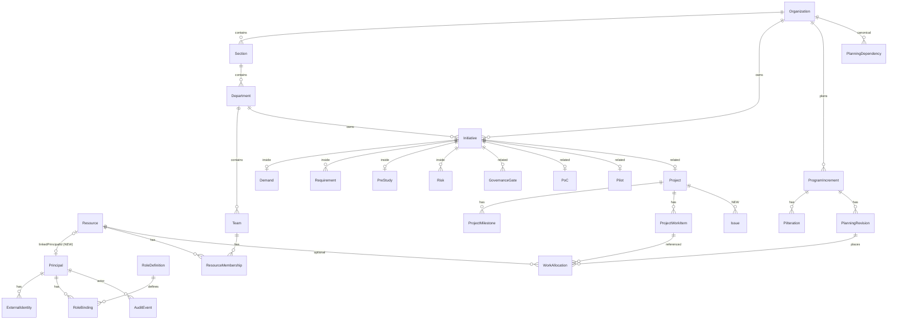

# Project Platform — Target Architecture & Domain Model

**Repository:** [Jonassan1990/ManagmentPlatform](https://github.com/Jonassan1990/ManagmentPlatform)  
**Basis:** Independent code inspection + `PROJECT-PLATFORM-AS-IS-AUDIT.md` (≈58% functional completion)  
**Document type:** Design / architecture review only — **no code, schema, or migration changes**  
**Date:** 2026-10-08  

---

## Management copy box

```text
══════════════════════════════════════════════════════════════
TARGET ARCHITECTURE REVIEW — COPY FOR GPT
Repo: Jonassan1990/ManagmentPlatform
Doc: PROJECT-PLATFORM-TARGET-ARCHITECTURE.md
Based on: PROJECT-PLATFORM-AS-IS-AUDIT.md (~58% AS-IS)
══════════════════════════════════════════════════════════════

ARCHITECTURE HEALTH: ACCEPTABLE → GOOD foundation (evolve, do not rebuild)
SAFE TO EVOLVE? YES WITH REFACTORING (mainly GovernanceService split + ownership/identity link)

TOP 5 PROBLEMS
1) Principal (login) ≠ Resource (capacity) with no link → ownership & planning disconnect
2) Free-text business ownership → cannot answer "what does this person own?"
3) RBAC scope underused: PLATFORM too broad; mutations mostly ORGANIZATION-scoped; role admin UI missing
4) GovernanceService is a god-module (gates + PoC + Pilot + convertToProject)
5) Delivery/Portfolio incomplete: no Issue entity; portfolio is Overview tiles only

TOP 5 PRESERVE
1) Initiative as durable lifecycle root (ADR-003)
2) Immutable approvals/decisions + review snapshots
3) Idempotent Initiative→Project conversion + Restrict FK (ADR-010)
4) PI Planning: hours capacity, WorkAllocation references WI, immutable PiBaseline
5) Modular monolith + Server Actions → assertCan → Prisma → audit.record

MOST IMPORTANT DECISION
Keep Principal and Resource as separate concepts; add optional Resource.linkedPrincipalId
(nullable unique). Business ownership → Resource FK; platform actors stay Principal FK.

RECOMMENDED FIRST IMPLEMENTATION PHASE
Phase 0A — Identity ↔ Resource optional link (schema + APIs; no rename; free-text kept)
Parallel ops: Production OIDC + managed Postgres (does not rewrite domain)

DO NOT
Rebuild app; replace PI Planning; merge Principal into Resource; auto-create PoC/Project on GO
══════════════════════════════════════════════════════════════
```

---

## 1. Executive Summary

The existing codebase is a **viable modular-monolith foundation**, not a prototype to discard. Initiative lifecycle, governance immutability, PoC/Pilot as first-class objects, project conversion traceability, and PI planning (hours, allocations, conflicts, baselines) are architecturally sound and must be **preserved**.

The platform should evolve by **linking identity to capacity people**, **normalizing ownership to referential FKs**, **hardening scoped RBAC**, **splitting the overloaded Governance write module**, and **extending** delivery, dependencies, portfolio read models, and collaboration — in that dependency order.

**Architecture health: ACCEPTABLE** (leaning GOOD for MVP domains; incomplete for enterprise portfolio/delivery).  
**Evolve safely? YES WITH REFACTORING** — targeted module boundaries and ownership/identity links; **not** a rewrite.

---

## 2. Architecture Assessment

### Call path (verified)

```text
UI (App Router)
  → Server Actions (src/app/actions/*)
    → Application services (src/modules/*/application/*)
      → Zod schemas + readiness/capacity/conflict policies
      → Prisma transactions
      → AuthorizationService.assertCan(principal, permission, AuthScope)
      → AuditService.record(...)
```

Only HTTP domain edge beyond Auth.js: Server Actions. This matches `docs/ARCHITECTURE.md` and should **KEEP**.

### Strengths

| Strength | Evidence |
|---|---|
| Lifecycle root + stage data | `Initiative` + Demand/Requirements/PreStudy |
| Governance immutability | `ReviewSnapshot`, `ApprovalRecord`, `DecisionRecord` |
| Experimentation distinct from delivery | `PoC`, `Pilot` 1:1 Initiative; Project separate |
| Conversion safety | `Project.initiativeId @unique`, `onDelete: Restrict` |
| Planning non-copy | `WorkAllocation.workItemId` references `ProjectWorkItem` |
| Capacity unit clarity | ADR-012 hours; `capacity-policy.ts` |
| Baseline immutability | `PiBaseline.payload` never updated; rebaseline = new version |
| Auth identity key | `ExternalIdentity (issuer, subject)` — never email alone |

### Weaknesses (architectural, not cosmetic)

1. No Principal↔Resource bridge  
2. Free-text ownership fields dominate business accountability  
3. Scope model present but product uses coarse ORGANIZATION / PLATFORM  
4. `GovernanceService` write concentration (~2.6k LOC)  
5. Delivery depth and portfolio read model underbuilt  
6. Dependencies subject types too narrow for vision  
7. Audit write-only; documents/comments/notifications incomplete  

---

## 3. Existing Architecture Worth Preserving

| Component | Action | Why |
|---|---|---|
| Modular monolith | **KEEP** | Cross-stage transactions (decision + stage + audit) fit monolith |
| Server Actions + application services | **KEEP** | Clear edge; UI not sole control |
| `Initiative` as durable lifecycle identity | **KEEP** | ADR-003; prevents disconnected stage apps |
| Early lifecycle write ownership in `InitiativeService` | **KEEP** | Demand→Pre-study already correctly bounded |
| Governance immutability model | **KEEP** | Recommendation ≠ decision; snapshots; conditions |
| Explicit createPoC / createPilot / convertToProject | **KEEP** | No auto-decision; auditable progression |
| `ResourceMembership` + `allocationPercent` | **KEEP** | ADR-001; multi-team capacity without double-count |
| PI Planning engines (capacity, conflict, baseline) | **KEEP** | Mature; do not rewrite |
| Canonical `PlanningDependency` (single store) | **KEEP** / **EXTEND** | ADR-015 — extend subjects, don’t fork tables |
| `AuditEvent` append-only writes | **KEEP** / **EXTEND** | Add query/read later |
| Principal ≠ Resource conceptual split | **KEEP** | Correct DDD separation; link optionally |

---

## 4. Critical Domain Problems

| # | Problem | Impact if ignored |
|---|---|---|
| P1 | Principal/Resource disconnect | Cannot plan capacity for logged-in people; ownership queries impossible |
| P2 | Free-text owners | No reliable “what does X own?”; reporting & auth by ownership blocked |
| P3 | Coarse RBAC + PLATFORM `scopeMatches` returns true for all | Least privilege impossible; section/dept managers not first-class |
| P4 | Governance god-service | Hard to evolve PoC/Pilot/Delivery without regression risk |
| P5 | Incomplete delivery/issue model | Post-SCALE execution weaker than pre-project governance |
| P6 | Dependency subject gap | Portfolio dependency questions incomplete |
| P7 | Portfolio = metrics tiles | Senior management helicopter view not a domain |
| P8 | Collaboration/docs ports missing | Evidence remains text/metadata-heavy |

---

## 5. Target Domain Model

### Lifecycle (unchanged intent)

```text
Demand → Requirements → Pre-study → Gate → PoC → Eval → Decision
  → Pilot → Eval → Scale Decision → Project → PI Planning → Execution → Closure
```

**Invariant:** One Initiative identity for the whole path; PoC/Pilot/Project are related records, not replacements.

### Conceptual layers

```text
Platform Identity          Organization & Capacity         Lifecycle & Delivery
─────────────────          ───────────────────────         ────────────────────
Principal                  Organization                    Initiative (root)
ExternalIdentity           Section                         Demand / Requirements / PreStudy
RoleDefinition/Binding     Department                      Governance* (gates/decisions)
                           Team                            PoC* / Pilot*
                           Resource ←optional→ Principal   Project*
                           ResourceMembership              WorkItem / Milestone / Issue*
                           ResourceAvailability            ProgramIncrement*
                                                           WorkAllocation / PiBaseline
                                                           PlanningDependency*
```

\* related aggregates linked by FK, not nested transactionally forever.

---

## 6. Identity / Person / Resource Model

### Current

| Concept | Role today |
|---|---|
| `Principal` | Login subject; RoleBindings; governance actors |
| `ExternalIdentity` | OIDC `(issuer, subject)` |
| `Resource` | Capacity-bearing PERSON/OTHER; memberships; allocations |
| Link | **None** |

Schema comments already state Resource ≠ Principal — correct.

### Decision: **KEEP separation + EXTEND optional link**

```text
Principal  (authN/authZ actor)
    ↑ optional 0..1
    │ linkedPrincipalId (unique, nullable)
Resource   (org person / capacity unit)
```

**Direction of FK:** `Resource.linkedPrincipalId → Principal.id` (nullable, unique).

| Scenario | Model |
|---|---|
| Employee with login + capacity | Resource + Principal linked |
| Employee without platform access | Resource only |
| External approver / viewer | Principal only (no Resource) |
| Service account | Principal only |
| Equipment / OTHER capacity | Resource `type=OTHER`, no Principal |
| Disabled login | Principal retained; bindings `effectiveTo`; Resource may stay ACTIVE for history |
| Future hire | Resource DRAFT/ACTIVE without Principal until onboarded |

### Rejected alternatives

| Alternative | Why rejected |
|---|---|
| Merge Principal into Resource | Breaks service accounts, OIDC JIT least privilege, Phase 6 identity |
| Require Principal for every Resource | Blocks non-login staff & OTHER resources |
| Ownership only on Principal | Capacity people without login cannot own work |

### Action

**EXTEND** — add optional link; do **not** rename Resource to Person in schema now (docs may say “Person/Resource”; code keeps `Resource` to avoid churn). UI label “Person” is fine.

---

## 7. Ownership Model

### Inventory of ownership-like fields (current)

| Field | Entity | Type today | Target |
|---|---|---|---|
| `requesterName` (+ contact) | Initiative | Free-text | **EXTEND**: add `requesterResourceId?`; keep name as snapshot/display fallback |
| `businessOwnerName` (+ contact) | Initiative | Free-text | **EXTEND**: add `businessOwnerResourceId?` (**required eventually** for ACTIVE initiatives) |
| `ownerName` | Requirement, Assessment, Risk, Document, PoC, Pilot, Project, Milestone, WorkItem, DecisionCondition, PlanningDependency | Free-text | **EXTEND**: add `ownerResourceId?` on accountability-critical entities first |
| `planningOwnerName` | PI, PiParticipatingDepartment | Free-text | **EXTEND**: `planningOwnerResourceId?` |
| `submittedByPrincipalId` | GovernanceSubmission | Principal FK | **KEEP** (platform actor) |
| `approverPrincipalId` | ApprovalRecord | Principal FK | **KEEP** |
| `decisionMakerPrincipalId` | DecisionRecord | Principal FK | **KEEP** |
| `assignedPrincipalId` | ApprovalRequest | Principal FK unused | **EXTEND**: wire assignee workflow |
| `actorPrincipalId` | LifecycleTransition, AuditEvent | Principal | **KEEP** |
| `createdByPrincipalId` | PiBaseline | Principal | **KEEP** |
| Sponsor | — | Missing | **EXTEND**: `sponsorResourceId?` on Initiative |
| `submittedByName` | PilotFeedback | Free-text | **KEEP** as external feedback attribution (optional later Principal) |

### Ownership strategy

```text
Business accountability  → Resource FK (who in the organization owns the outcome)
Platform action actor    → Principal FK (who clicked approve / decide / allocate)
Display / migration      → retain *Name snapshot fields during compatibility period
```

### Queries enabled after normalization

```text
What does Resource X own?
  → initiatives where businessOwnerResourceId = X
  → projects/risks/deps/work items where ownerResourceId = X

Who owns Initiative I?
  → Resource via businessOwnerResourceId (+ snapshot name)
```

### Free-text still acceptable

- External feedback names  
- Temporary notes / “ownerName” during import staging  
- Historical snapshot labels on immutable decision packages (already frozen in snapshots)

### Action

**EXTEND** schema + services; **DEPRECATE** free-text as sole source of truth after backfill; do not hard-delete name columns in first migration.

---

## 8. Authorization Model

### Current reality

| Dimension | Status |
|---|---|
| Permission catalog | Rich (`permissions.ts`) |
| Scope types | PLATFORM, ORGANIZATION, SECTION, DEPARTMENT, TEAM |
| Matching | Implemented in `scopeMatches` |
| Product roles | Only `platform.bootstrap_admin`, `organization.admin` |
| Mutation scopes | Mostly `{ type: "ORGANIZATION", organizationId }` |
| PLATFORM binding | **Satisfies all requested scopes** (`scopeMatches` early return true) |
| Object-scoped / ownership-based | Not implemented |
| Role admin UI | Missing (`ROLE_MANAGE` unused) |

### Target model: Permission + Scope + Relationship

```text
assertCan(principal, permission, scope)
  OR
relationshipAllows(principal, permission, object)
    e.g. businessOwnerResource.linkedPrincipalId == principal.id
```

Keep RoleDefinition as **permission packs**, not hundreds of one-off roles.

### Recommended configurable role packs (keys are config, not UI hardcodes)

| Pack (example key) | Typical scope | Permissions (illustrative) |
|---|---|---|
| Platform Admin | PLATFORM | bootstrap, role.manage, org.manage, audit.read |
| Portfolio Manager | ORGANIZATION / SECTION | initiative.view, project.view, pi.view, decision.make (section), governance.view |
| Section Manager | SECTION | cross-dept view, PI create/review, attention |
| Department Manager | DEPARTMENT | initiative.*, local project edit, allocate within dept teams |
| Team Manager | TEAM | team capacity, allocate team cell |
| Project Manager | ORGANIZATION + ownership relation | project.edit, milestones, work items for owned projects |
| Initiative Owner | ownership relation | initiative.edit / manage_* for owned initiative |
| Approver packs | ORGANIZATION/DEPT | approval.review + authority.* |
| Viewer | ORGANIZATION/SECTION/DEPT | `*.view` only |
| Resource (contributor) | TEAM/DEPT | limited edit on assigned work |

### Scope hardening rules

1. **REFACTOR** `PLATFORM` matching: only satisfy `PLATFORM` requests and explicit bootstrap permissions — not all org mutations.  
2. **EXTEND** services to pass SECTION/DEPARTMENT/TEAM scopes where the object has those FKs.  
3. **EXTEND** optional ownership grant as additive allow (deny-by-default remains).  
4. **KEEP** UI capabilities as non-authoritative.

### Action

**KEEP** assertCan engine · **EXTEND** role packs + admin UI · **REFACTOR** PLATFORM scope breadth · **EXTEND** ownership-based allows.

---

## 9. Initiative Lifecycle Architecture

### Initiative remains the primary **lifecycle identity root** — KEEP

### Aggregate boundaries

| Inside Initiative aggregate (write owner: Initiative module) | Related aggregates (own services) |
|---|---|
| Initiative header, stage, status, version | **Governance**: Gate, Submission, Snapshot, Evidence, Approval*, Decision* |
| Demand | **PoC** (ops) |
| Requirements, AC, relations | **Pilot** (ops) |
| PreStudy, assessments, alternatives | **Project** (delivery) |
| Risks (initiative-scoped canonical) | **PI Planning** (org-scoped planning) |
| ManagedDocument metadata | |
| LifecycleTransition | |

### Stage representation

Keep `InitiativeStage` enum for current position. PoC Evaluation / Scale Decision remain **gate + decision outcomes**, not extra stage enum values — **KEEP** (avoids stage explosion). Document this as product language mapping:

| Product language | System representation |
|---|---|
| PoC Evaluation | `PoC.status = EVALUATION` + PoC gate readiness |
| Scale Decision | `PILOT_GATE` + DecisionOutcome SCALE/… |
| Execution / Delivery / Closure | `Project.status` + work/milestone/issue progress |

### Governance module boundary — REFACTOR

Split write ownership conceptually (package/services; tables can stay):

```text
governance/     → gates, submissions, approvals, decisions, policy
experimentation/ → PoC + Pilot operational services (still used by governance submit readiness)
delivery/        → Project (existing project module) + convert orchestration facade
```

`convertToProject` should become a **thin application orchestration** that calls Governance (preconditions) + Project (create) + Initiative (stage), not a 200-line private empire inside Governance forever.

### Action

**KEEP** Initiative root · **KEEP** related 1:1 PoC/Pilot/Project · **REFACTOR** GovernanceService boundaries · do **not** move PoC writes back into InitiativeService.

---

## 10. Project / Delivery Architecture

### Current: PARTIAL but correct spine

Project ← Initiative (unique), milestones, work items, budget fields, participating departments, traceability read.

### Target entities

| Entity | Action | Rationale |
|---|---|---|
| Project | **KEEP** | Delivery aggregate root |
| ProjectMilestone | **KEEP** | Dates/criticality enough; “Deliverable” as milestone flag/category later if needed |
| ProjectWorkItem | **KEEP** | Epic/Feature/Task; PI allocation target |
| Deliverable (new table) | **DEFER** | Avoid duplicate of Milestone until product proves need |
| Issue (new) | **EXTEND** | Happened problems/blockers distinct from Risk |
| Risk | **KEEP** on Initiative; **EXTEND** optional `projectId` or subject ref for project-contextual risks |
| PlanningDependency | **KEEP**/EXTEND | Canonical deps |
| Team assignment | **EXTEND** lightly | Participating departments exist; optional `ProjectParticipatingTeam` if needed — only if PI participation insufficient |
| Resource allocation (project-level standing) | **DEFER** | PI `WorkAllocation` is SoT for planned load; avoid second allocation ledger |
| Progress | **EXTEND** derived | % from work item status / milestone completion — prefer derived over stored % |
| Closure | **EXTEND** | Closure checklist fields or `ProjectClosure` record (reason, date, principal) when status → COMPLETED |

### Traceability — KEEP

```text
Initiative 1—1 PoC?
Initiative 1—1 Pilot?
Initiative 1—1 Project   (Restrict, unique)
Project → WorkItems → WorkAllocations (PI)
Decisions remain on Initiative/gates
```

### Action

**EXTEND** Project module; do not invent a second project system.

---

## 11. PI Planning Architecture

### Classification of current PI stack

| Piece | Action |
|---|---|
| `ProgramIncrement` + status machine | **KEEP** |
| `PiIteration` | **KEEP** |
| Participating departments/teams | **KEEP** |
| `PlanningRevision` CURRENT | **KEEP** / **EXTEND** for scenarios |
| `WorkAllocation` | **KEEP** |
| Capacity policy + views | **KEEP** |
| Conflict engine (derived) | **KEEP** |
| `PlanningDependency` | **KEEP** / **EXTEND** subjects |
| `PiBaseline` immutable | **KEEP** |
| HTML5 DnD board | **KEEP** / UX polish later (not architectural REPLACE) |
| Scenario A/B UI | **EXTEND** (foundation exists) |

### Target shape

```text
PI
├── Iterations
├── Participating Departments / Teams
├── PlanningRevisions (CURRENT + Scenario keys)
│     └── WorkAllocations → WorkItem, Iteration, Team, Resource?
├── Capacity (derived + ResourceAvailability overrides)
├── Dependencies (canonical org store; PI views filter)
├── Conflicts (derived on read)
└── PiBaselines (immutable versions)
```

Projects enter PI by **work items belonging to projects in participating departments** — KEEP. Optional later: explicit `PiParticipatingProject` for clarity (**EXTEND** only if filtering pain appears).

---

## 12. Planning Scenarios

### Current

`PlanningRevision { key, isCurrent }` — PI create seeds `key='CURRENT', isCurrent=true`. Allocations belong to a revision. Baseline captures revision id + JSON payload.

### Target workflow — EXTEND (compatible)

```text
Create PI → CURRENT revision
→ optionally create Scenario A/B/C revisions (isCurrent=false)
→ allocate on selected working revision
→ compare capacity/conflicts across revisions (read models)
→ selectScenario → mark chosen as isCurrent (or copy into CURRENT)
→ createBaseline from current revision → immutable PiBaseline
```

### Rules

1. Only **one** `isCurrent=true` per PI.  
2. Baselines remain immutable snapshots; scenarios never mutate old baselines.  
3. MVP path unchanged: single CURRENT works without scenarios.  
4. Prefer **allocate against explicit revisionId** in APIs (today implicitly CURRENT) — small **REFACTOR** of allocation service signatures when scenarios ship.

### Action

**EXTEND** PlanningRevision · **KEEP** baseline semantics · no REPLACE.

---

## 13. Capacity / Allocation Model

### Definitions (target clarity)

| Concept | Meaning | Persistence |
|---|---|---|
| Team membership | Resource belongs to Team with `%` share | `ResourceMembership` **SoT** |
| Resource capacity | Weekly hours capacity of person/asset | `Resource.capacityHoursPerWeek` **SoT** |
| Availability override | Leave / exception for an iteration | `ResourceAvailability` **SoT** |
| Project allocation | Standing “assigned to project” (future) | **Not SoT for load** — optional membership metadata only |
| PI / iteration allocation | Planned load hours on WI in iteration/team | `WorkAllocation.plannedHours` **SoT for committed load** |

### Formula (KEEP ADR-012)

```text
EffectiveCapacity(resource, team, iteration) =
  f(capacityHoursPerWeek, membership%, weeks, availability override/reduction)

CommittedLoad = Σ WorkAllocation.plannedHours (for revision)

Remaining = EffectiveCapacity − CommittedLoad
```

Aggregate to team / iteration / PI by summing.

### Anti-patterns to forbid

- Storing utilization % as authoritative  
- Duplicating load into Project rows  
- Mixing story points into utilization  
- Counting full weekly capacity on every team membership (percent exists to prevent this)

### Action

**KEEP** capacity-policy as single calculation path · **EXTEND** only for Principal-linked resource resolution in UI.

---

## 14. Dependency Model

### Current

`PlanningDependency`: polymorphic `sourceType/sourceId` + `targetType/targetId` where types ∈ {WORK_ITEM, PROJECT}. Canonical org store (ADR-015).

### Alternatives

| Option | Pros | Cons |
|---|---|---|
| A. Extend enum subjects on same table | Minimal churn; one SoT; matches ADR-015 | Weaker FK integrity |
| B. Typed junction tables per pair | Strong FKs | Many tables; query complexity |
| C. Fully generic JSON edges | Flexible | Worse integrity/reporting |

### Decision: **EXTEND Option A**

Add to `DependencySubjectType`: `INITIATIVE`, `TEAM`, `MILESTONE` (and keep WORK_ITEM, PROJECT).

Application service validates existence + org consistency (as today for WI/Project). Owner → `ownerResourceId` (EXTEND). Keep type/status/criticality/neededByDate.

PI visibility: filter dependencies whose endpoints appear in PI allocations or participating projects — derived, not a second store.

### Action

**KEEP** canonical entity · **EXTEND** subjects + resource owner · **do not REPLACE**.

---

## 15. Risk / Issue / Blocker Model

### Recommendation (avoid overengineering)

| Concern | Model | Action |
|---|---|---|
| Risk (uncertain future harm) | Keep `Risk` (probability/impact/mitigation) | **KEEP**; **EXTEND** optional `projectId` or subject |
| Issue (materialized problem) | New `Issue` on Project (severity, status, ownerResourceId, relatedRiskId?) | **EXTEND** |
| Blocker | **Not** a third root entity | Flag on Issue (`isBlocker`) and/or Dependency status/criticality |

PI “risk” views: query Initiative/Project risks linked to work in PI — read model, not `PiRisk` fork.

### Action

**KEEP** Risk · **EXTEND** Issue · **DEPRECATE** idea of separate Blocker table.

---

## 16. Portfolio Architecture

### Current

`/` Overview: `getOverviewMetrics` + `getExecutivePiMetrics` — real SQL aggregates, not mocks.

### Target (modular monolith read model)

Add `PortfolioQueryService` (or `reporting` module) that **reads** transactional tables / light SQL views:

| Question | Source |
|---|---|
| Initiatives & stages | Initiative |
| Awaiting decisions/approvals | GovernanceSubmission / ApprovalRequest |
| Investment committed | Project budget fields + Pilot/PoC cost fields |
| Delayed projects | Milestone MISSED / plannedEnd vs now |
| Blocked | Open blocker Issues + CRITICAL open deps |
| Team overload | capacity-policy + allocations (CURRENT revision) |
| PI overcommit | conflict engine TEAM_OVERLOAD counts |
| Critical dependencies | PlanningDependency criticality |

**No microservice.** Optional materialized SQL view later if performance demands — still same DB.

### Action

**EXTEND** reporting/portfolio module · **KEEP** transactional SoT.

---

## 17. Shared Platform Capabilities

| Capability | Target module | Attachment pattern | Action |
|---|---|---|---|
| Documents | `documents` | `ManagedDocument` already initiative-scoped; generalize `subjectType/subjectId` later; storage port for blobs | **EXTEND** |
| Comments | `collaboration` | `Comment(subjectType, subjectId, authorPrincipalId, body)` | **EXTEND** (new) |
| Notifications | `notifications` | Outbox row + channel adapters; producers emit from services | **EXTEND** (new) |
| Audit | `audit` | Keep `record`; add query API + UI | **EXTEND** |

Modules depend **inward** on shared kernel (IDs, errors, permissions). Domain modules may call Documents/Comments/Notifications ports; those modules must **not** import Initiative/Governance internals.

---

## 18. Target Module Architecture

```text
src/modules/
  shared/                 # permissions, errors, ids
  identity-access/        # Principal, bindings, assertCan
  organization/           # org tree, resources, memberships
  initiative/             # early lifecycle aggregate
  governance/             # gates, approvals, decisions, policy
  experimentation/        # PoC + Pilot services (extract from governance)
  project/                # delivery aggregate (+ Issue later)
  pi-planning/            # PI, allocation, capacity, deps, baseline
  portfolio/              # read models / attention queries (new or evolve from overview)
  documents/              # metadata + storage port
  collaboration/          # comments (future)
  notifications/          # outbox (future)
  audit/                  # append + query
```

### Allowed dependency direction

```text
UI/actions → application services
services → identity-access, audit, shared
initiative → governance (read policies / metrics) carefully
experimentation → initiative (read), governance (types/policies)
project → initiative (read traceability), identity, audit
pi-planning → project (read WI), organization (read capacity), identity, audit
portfolio → all (read-only)
documents/collaboration/notifications → shared (+ ports); called by services
```

### Forbidden

- UI → Prisma bypassing services  
- pi-planning copying WorkItem fields into allocation rows  
- project owning Initiative stage transitions  
- notifications importing Prisma models of every domain (use event DTO ports)  
- circular governance ↔ initiative service writes  

### Action

**KEEP** monolith · **REFACTOR** extract experimentation · **EXTEND** portfolio/collaboration/documents/notifications packages.

---

## 19. Domain Mermaid Diagram



**Existing** = unlabeled. **NEW/proposed** = linkedPrincipalId, Issue, generalized comments/notifications (not all shown).

---

## 20. Current → Target Change Matrix

| Area | Current State | Target State | Action | Migration Risk | Priority |
|---|---|---|---|---|---|
| Modular monolith | Working | Same | **KEEP** | None | — |
| Principal / Resource | Disconnected | Optional link on Resource | **EXTEND** | Low | P0 |
| Free-text ownership | Sole SoT | Resource FK + name snapshot | **EXTEND** / **DEPRECATE** sole text | Medium | P0 |
| RBAC engine | assertCan + scopes | Same + packs + hardened PLATFORM | **KEEP** / **REFACTOR** | Medium | P0 |
| Role admin UI | Missing | Bindings UI | **EXTEND** | Low | P0 |
| Initiative root | Correct | Same | **KEEP** | None | — |
| Governance immutability | Strong | Same | **KEEP** | None | — |
| GovernanceService size | God module | Split experimentation / orchestration | **REFACTOR** | Medium | P1 |
| PoC / Pilot model | Strong | Same tables; clearer module | **KEEP** / **REFACTOR** (code loc) | Low | P1 |
| Project delivery | Partial | + Issue + closure | **EXTEND** | Low | P1 |
| PI Planning | Mature | Same + scenarios | **KEEP** / **EXTEND** | Low | P2 |
| PlanningRevision | CURRENT only | Multi-scenario | **EXTEND** | Low | P2 |
| PiBaseline | Immutable | Same | **KEEP** | None | — |
| Capacity policy | Hours SoT | Same | **KEEP** | None | — |
| Dependencies | WI/Project | + Initiative/Team/Milestone | **EXTEND** | Low–Med | P2 |
| Risk | Initiative only | + project context | **EXTEND** | Low | P2 |
| Issue / Blocker | Missing | Issue + blocker flag | **EXTEND** | Low | P2 |
| Portfolio | Overview tiles | Portfolio query module | **EXTEND** | Low | P3 |
| Documents | Metadata | + storage port | **EXTEND** | Med | P3 |
| Comments / Notifications | Missing | Shared modules | **EXTEND** | Med | P3 |
| Audit read | Write-only | Query + UI | **EXTEND** | Low | P1 |
| Merge Principal=Resource | N/A | Do not | **REJECT / DEPRECATE idea** | — | — |
| Rewrite PI board | Working | Do not | **KEEP** | — | — |

---

## 21. Migration Impact (future — do not execute now)

### A. Principal ↔ Resource link

| Item | Plan |
|---|---|
| Existing data | All Resources remain valid with `linkedPrincipalId = null` |
| Backfill | Manual admin linking; optional match on email snapshot ≠ identity key (suggest only) |
| Compatibility | UI shows unlinked resources; capacity works unchanged |
| Rollback | Drop nullable column; no destructive rewrite |

### B. Free-text → Resource ownership FKs

| Item | Plan |
|---|---|
| Existing data | Keep `*Name` columns; add nullable `*ResourceId` |
| Backfill | Admin mapping tool; leave unmatched as name-only |
| Compatibility period | Reads: prefer FK display name, fallback to text |
| Validation | Phase later: require FK on new ACTIVE initiatives |
| Rollback | Stop writing FKs; columns remain |

### C. Dependency subject enum extension

| Item | Plan |
|---|---|
| Existing rows | Unchanged WI/PROJECT |
| Backfill | None required |
| Compatibility | Old clients ignore new types |
| Rollback | Stop creating new subject types |

### D. Risk/Issue introduction

| Item | Plan |
|---|---|
| Risks | Remain; optional projectId null |
| Issues | New table empty; no conversion from Risk automatically |
| Rollback | Drop Issue table |

### E. Planning scenarios

| Item | Plan |
|---|---|
| Existing | Single CURRENT revision continues |
| Backfill | None |
| Compatibility | Allocation APIs default revision=CURRENT |
| Rollback | Hide scenario UI; keep extra revisions inert |

### F. PLATFORM scope refactor

| Item | Plan |
|---|---|
| Risk | Bootstrap admin may lose implicit org-wide power |
| Mitigation | Ensure org-admin bindings exist; feature-flag matcher change |
| Rollback | Revert matcher |

---

## 22. Architecture Invariants

Future agents **MUST NOT** violate:

1. **Initiative is the durable lifecycle identity** — do not split Demand/PoC/Pilot/Project into disconnected apps without `initiativeId` traceability.  
2. **Recommendation ≠ Decision** — never auto-copy recommendation into `DecisionRecord.outcome`.  
3. **Approved governance artifacts are immutable** — do not update `ApprovalRecord`, `DecisionRecord`, or `ReviewSnapshot.payload` in place.  
4. **GO does not auto-create PoC / Pilot / Project** — explicit authorized actions only.  
5. **Project conversion is idempotent** — at most one Project per Initiative (`initiativeId` unique).  
6. **Project→Initiative FK uses Restrict** — deleting Initiative must not silently erase delivery history.  
7. **PI allocations reference WorkItems** — never copy title/estimate into allocation rows as SoT.  
8. **Capacity unit is hours** — no story points in utilization math.  
9. **Membership allocationPercent sum ≤ 100** for active memberships — no double-counted capacity.  
10. **Conflicts are derived on read** (MVP) — do not introduce stale conflict cache without an ADR.  
11. **PiBaseline.payload is immutable** — rebaseline creates a new version.  
12. **Principal ≠ Resource** — authentication identity must not be collapsed into capacity; link is optional.  
13. **OIDC identity key is `(issuer, subject)`** — never email alone.  
14. **Production forbids DEV auth.**  
15. **UI must not bypass application services** for domain mutations.  
16. **Authorization is enforced in application services** — UI capability flags are non-authoritative.  
17. **Audit events are append-only.**  
18. **Empty organization is a valid starting state** — no hardcoded business seed required.  
19. **Canonical dependencies live in one store** — modules project/read; do not fork dependency tables.  
20. **Planning load SoT is `WorkAllocation.plannedHours` on a revision** — do not create a second competing allocation ledger without ADR.

---

## 23. Proposed ADR Summaries

### ADR-020 — Principal ↔ Resource optional link

- **Context:** Login Principals and capacity Resources are disconnected; ownership and planning need a bridge without merging concepts.  
- **Decision:** Add nullable unique `Resource.linkedPrincipalId → Principal`.  
- **Alternatives:** Merge entities; require Principal for all Resources; link table many-to-many.  
- **Consequences:** Supports staff without login, service accounts, OTHER resources; enables ownership queries via Resource.  
- **Migration:** Additive nullable column; manual link backfill.

### ADR-021 — Ownership via Resource FK + name snapshot

- **Context:** Free-text owners block reliable accountability queries and ownership-based authZ.  
- **Decision:** Accountability fields gain `ownerResourceId` / `businessOwnerResourceId`; retain `*Name` as snapshot/fallback; platform actors remain Principal FKs.  
- **Alternatives:** Owner as Principal only; pure free-text forever.  
- **Consequences:** “What does X own?” becomes SQL; migration compatibility period required.  
- **Migration:** Additive FKs; deprecate text-as-SoT later.

### ADR-022 — Authorization = Permission + Scope + Relationship

- **Context:** Scope enum exists but product is org-admin-centric; PLATFORM matcher is overly broad.  
- **Decision:** Keep RoleBinding scopes; add role packs; harden PLATFORM; allow ownership-based additive grants.  
- **Alternatives:** Full ABAC engine now; object ACL tables for every entity.  
- **Consequences:** Dept/section managers become expressible; requires role admin UI.  
- **Migration:** Data-compatible; matcher change needs binding audit.

### ADR-023 — Extend PlanningDependency subjects

- **Context:** Vision needs Initiative/Team/Milestone deps; ADR-015 already chose canonical polymorphic store.  
- **Decision:** Extend `DependencySubjectType`; validate in application layer.  
- **Alternatives:** Typed junction tables; separate stores per module.  
- **Consequences:** One SoT preserved; weaker DB FKs accepted with service validation.  
- **Migration:** Enum/check additive.

### ADR-024 — Risk vs Issue separation

- **Context:** Need both uncertain risks and materialized delivery issues/blockers.  
- **Decision:** Keep `Risk`; add `Issue` on Project with optional `isBlocker`; do not create Blocker entity.  
- **Alternatives:** Single Concern table; Blocker as third root.  
- **Consequences:** Clear language; PI blockers can surface from Issues + Dependencies.  
- **Migration:** New Issue table only.

### ADR-025 — Planning scenarios via PlanningRevision

- **Context:** CURRENT revision foundation exists; scenarios desired without harming baselines.  
- **Decision:** Multiple revisions per PI; one `isCurrent`; baseline snapshots chosen revision; APIs gain revisionId.  
- **Alternatives:** Separate Scenario aggregate copying allocations; branch-by-PI-clone.  
- **Consequences:** Compare scenarios without mutating baselines; MVP CURRENT path unchanged.  
- **Migration:** Additive rows; default CURRENT.

---

## 24. Implementation Dependency Map

```text
Production Ops (OIDC+DB) ─────────────────────────────┐
                                                      ├→ usable prod
0A Resource↔Principal link ──→ 0B Ownership FKs ──→ 0C RBAC packs + PLATFORM harden
         │                         │                      │
         └─────────────────────────┴──────────→ ownership-based authZ
                                                      │
                    ┌─────────────────────────────────�──────────→ ownership-based authZ
                                                      │
                    ┌─────────────────────────────────┘
                    ↓
         GovernanceService REFACTOR (experimentation extract)
                    ↓
         Project/Delivery EXTEND (Issue, closure)
                    ↓
         PI scenarios EXTEND + Dependency subjects EXTEND
                    ↓
         Portfolio read module
                    ↓
         Documents storage + Comments + Notifications
                    ↓
         Hardening (E2E, observability, import)
```

---

## 25. Recommended Implementation Roadmap

> **Do not implement in this review.** Order adjusted from the prompt: production ops can run **in parallel** with 0A; domain linking before delivery expansion.

### Phase 0 — Production identity ops (parallel)
- **Objective:** Real SSO + DB so architecture is exercisable in prod.  
- **Domain changes:** None.  
- **Modules:** `identity-access`, `server/auth`, deploy docs.  
- **Schema:** None.  
- **Prereq:** IdP + managed Postgres credentials.  
- **Acceptance:** OIDC login → bootstrap → create org without DEV auth.

### Phase 0A — Identity ↔ Resource link
- **Objective:** Optional Principal–Resource bridge.  
- **Domain:** `Resource.linkedPrincipalId`.  
- **Modules:** organization, identity-access, UI resource forms.  
- **Schema:** Additive nullable unique FK.  
- **Compatibility:** All existing rows valid.  
- **Acceptance:** Link/unlink resource; capacity unchanged; service accounts remain Principal-only.

### Phase 0B — Ownership normalization
- **Objective:** Referential business ownership.  
- **Domain:** `businessOwnerResourceId`, key `ownerResourceId`s, optional sponsor.  
- **Modules:** initiative, governance (conditions), project, pi-planning deps, UI forms.  
- **Schema:** Additive FKs; keep name columns.  
- **Acceptance:** Query initiatives by owner Resource; create flow prefers picker.

### Phase 0C — RBAC / scoping hardening
- **Objective:** Least-privilege role packs + safer PLATFORM matching + bindings UI.  
- **Domain:** RoleDefinition seeds; RoleBinding admin; matcher refactor.  
- **Modules:** identity-access, org admin UI, service scope arguments.  
- **Schema:** Possibly none (data for roles).  
- **Prereq:** 0A helpful for ownership grants; 0B for relationship auth.  
- **Acceptance:** Department manager cannot mutate other departments; PLATFORM bootstrap cannot silently pass all scopes after harden.

### Phase 1 — Governance module refactor + Delivery completion
- **Objective:** Split experimentation writes; Issue + closure on Project.  
- **Domain:** Issue model; ProjectClosure or closure fields; service extraction (no table rename required).  
- **Modules:** governance, experimentation (new package), project.  
- **Schema:** Issue (+ optional closure).  
- **Acceptance:** Same lifecycle E2E green; Issues block portfolio “blocked” queries; convertToProject still idempotent.

### Phase 2 — PI Planning completion + scenarios
- **Objective:** Multi-revision scenarios; allocation by revisionId; compare UX.  
- **Domain:** PlanningRevision usage expansion.  
- **Modules:** pi-planning.  
- **Schema:** Minimal/none.  
- **Acceptance:** Scenario A/B allocate → compare → select → baseline immutable; CURRENT-only path still works.

### Phase 3 — Dependency + Risk/Issue context
- **Objective:** Broader dependency subjects; project-linked risks; blocker surfacing.  
- **Modules:** pi-planning, initiative, project, portfolio.  
- **Schema:** Enum extend; Risk.projectId optional.  
- **Acceptance:** Initiative↔Initiative dep; PI shows critical blockers.

### Phase 4 — Portfolio
- **Objective:** PortfolioQueryService answering management questions with filters.  
- **Modules:** portfolio (+ thin UI).  
- **Schema:** None or SQL views.  
- **Acceptance:** Section manager answers delayed/blocked/overload/awaiting-decision without Excel.

### Phase 5 — Collaboration / Documents / Notifications
- **Objective:** Storage port, comments, notification outbox.  
- **Modules:** documents, collaboration, notifications.  
- **Schema:** Comment, NotificationOutbox; storagePointer used.  
- **Acceptance:** Upload evidence referenced by governance; approver notified (at least in-app/outbox).

### Phase 6 — Hardening
- **Objective:** Browser E2E, observability, Excel import v1, audit export.  
- **Acceptance:** CI protects invariants; prod monitored.

---

## Appendix — Traceability to AS-IS audit

| AS-IS finding | Target response |
|---|---|
| 58% overall / strong governance & PI | Preserve; extend delivery/portfolio/identity link |
| Principal ≠ Resource | Optional link ADR-020 |
| Free-text ownership | ADR-021 |
| PLATFORM / coarse RBAC | ADR-022 |
| Governance god-service | Module REFACTOR Phase 1 |
| Dependency subjects narrow | ADR-023 |
| No Issue | ADR-024 |
| Scenario foundation | ADR-025 |
| Production blocked | Phase 0 ops parallel |

---

*End of target architecture review. No application code, schema, or migrations were modified.*
