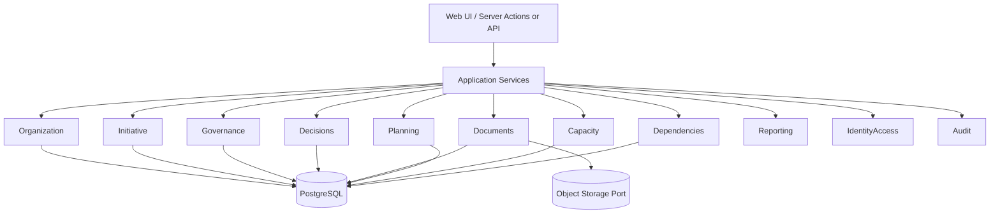

# Architecture

**Status:** Architectural recommendations for v1  
**Phase 0 note:** Documentation only — no scaffolding in this phase

---

## 1. Purpose

Document technical direction, modular-monolith reasoning, domain boundaries, persistence, authZ, audit, versioning, concurrency, migration, and deployment portability.

---

## 2. Initial Technical Direction

### Confirmed deployment target (first version)

```text
GitHub → Vercel
```

### Recommended stack (not scaffolded in Phase 0)

| Layer | Direction |
|---|---|
| Web app | Next.js + React + TypeScript |
| Styling | Tailwind CSS |
| Database | PostgreSQL |
| Persistence | Prisma or equivalent typed ORM/query layer |
| AuthN | Standards-based authentication |
| AuthZ | Server-side authorization |
| Local DB | PostgreSQL via Docker |

### Confirmed constraints

- Do **not** couple domain model tightly to Vercel.
- Application must be portable to another deployment environment later.
- Do **not** introduce unnecessary microservices for v1.
- Prefer clear domain boundaries inside a modular monolith.

---

## 3. Architectural Style Decision: Modular Monolith

### Recommendation (strong)

Adopt a **modular monolith** for the first implementation.

### Reasoning

| Factor | Monolith (modular) | Microservices (early) |
|---|---|---|
| Cross-stage transactions (gate + audit + transition) | Natural | Distributed complexity |
| Team size / early velocity | Higher | Lower |
| Deployment (Vercel-friendly web app + DB) | Simpler | Operational overhead |
| Domain boundary discipline | Achievable with modules | Forced but costly |
| Future extraction | Possible if boundaries clean | Premature |

### Confirmed non-goal

Microservices-first split by every domain for v1.

---

## 4. Domain Boundaries

Conceptual modules:

| Module | Responsibility |
|---|---|
| **Organization** | Org tree, teams, resources, memberships, availability |
| **IdentityAccess** | Principals, roles, bindings, permission checks |
| **Initiative** | Initiative aggregate, stages, demand, pre-study, PoC, Pilot linkages |
| **Requirements** | Requirement entities, relationships, baselines |
| **Governance** | Gates, policies, approvals, evidence packages |
| **Decisions** | Decision records, options, recommendations, supersession |
| **Documents** | Documentation Hub, versions, storage ports |
| **Portfolio** | Projects, milestones, budget fields, portfolio indices |
| **Planning** | PI, iterations, allocations, conflicts, baselines |
| **Capacity** | Capacity plans, utilization calculations |
| **Dependencies** | Canonical dependency store |
| **Reporting** | Attention queue projections, portfolio health read models |
| **Audit** | Structured audit persistence |
| **Import** (Future) | Excel import pipelines |



### Module rules (Recommendation)

- No cross-module table writes bypassing the owning module’s application API.
- Shared kernel limited to IDs, errors, auth primitives, time, money types.
- Read models for Reporting may subscribe to domain events or query carefully defined projections.

---

## 5. API Boundaries

### Recommendation for v1

- Next.js server-centric mutations (Server Actions and/or Route Handlers) as the application edge.
- Keep a clear **application service layer** so UI is not the only entry point.
- External API (REST/OpenAPI) can be added when integration demand appears; do not let UI forms become the domain.

### Confirmed

Authorization checks occur at the server edge before domain mutation.

---

## 6. Transaction Boundaries

| Example operation | Transaction expectation |
|---|---|
| Record Decision + link evidence | Single DB transaction |
| Approve document version + update lifecycle | Single DB transaction |
| Stage transition + gate satisfaction snapshot + audit | Single DB transaction |
| Planning drag reallocations affecting many rows | Transaction per user action; recalculation consistent before response or explicitly async with stale markers |
| Object storage upload + DB version row | Upload first with orphan GC strategy, or DB reservation then upload — choose explicitly in implementation |

Avoid distributed transactions across services by keeping v1 modular-monolith.

---

## 7. Authorization Boundaries

See [ROLES-AND-PERMISSIONS.md](./ROLES-AND-PERMISSIONS.md).

### Recommendation

Central policy evaluation function used by all application services:

`assertCan(principal, permission, resourceRef) → void | throw`

Resource references carry scope metadata (departmentId, sectionId, etc.).

---

## 8. Persistence Approach

| Topic | Direction |
|---|---|
| System of record | PostgreSQL |
| Access | Typed schema (Prisma or equivalent) |
| Migrations | Versioned migrations in repo |
| Multi-tenant | Organization_id on tenant-owned tables (**Open:** whether SaaS multi-tenant in v1) |
| Soft delete | Prefer archive flags for governance entities |
| JSON fields | Allowed for extensible attributes; core query fields remain columns |

### Confirmed

No fake business seed required for app boot (configuration/bootstrap only).

---

## 9. Audit Strategy

Structured audit events for material actions. See [AUDIT-AND-BASELINES.md](./AUDIT-AND-BASELINES.md).

Do not rely on unstructured log strings for governance reporting.

---

## 10. Versioning Strategy

| Area | Strategy |
|---|---|
| Documents | Immutable versions + supersession |
| Decisions | Immutable decided records + supersession |
| Approvals | Immutable finalized outcomes |
| Planning baselines | Snapshot documents (JSON/normalized tables) |
| Evidence packages | Revision IDs referenced by gates |
| API | Avoid breaking public API once published; not critical pre-MVP |

---

## 11. Concurrency Considerations

| Risk | Mitigation direction |
|---|---|
| Two approvers race | Row-level constraints / status preconditions |
| Stage transition races | Optimistic locking on initiative/stage version |
| Planning board simultaneous edits | Per-allocation updates with conflict detection; optional presence later |
| Baseline approve vs concurrent edits | Freeze or snapshot-on-approve semantics |

Exact locking scheme chosen in implementation phase with tests.

---

## 12. Migration Strategy

1. Schema migrations via tooling (Prisma Migrate or equivalent).
2. Data migrations scripted and reviewable.
3. Excel import is a separate bounded context (Future) writing through domain services—not raw SQL dumps. See [EXCEL-MIGRATION.md](./EXCEL-MIGRATION.md).
4. Environment promotion: local → preview → production with migration gates.

---

## 13. Deployment Portability

### Confirmed

Vercel is an **initial host**, not a domain constraint.

### Portability checklist

| Concern | Practice |
|---|---|
| File storage | Port/adapter interface |
| Auth provider | Standards-based; wrap vendor SDK |
| Background jobs | Abstract scheduler; if using vendor cron, isolate adapter |
| Config | Env-based; no Vercel-specific domain imports |
| Database | External PostgreSQL compatible (e.g., Neon/RDS/Cloud SQL later) |

Possible future hosts: container platform, traditional VM, alternate serverless—without rewriting domain modules.

---

## 14. Local Development (Future Implementation Phase)

Recommendation:

- `docker compose` for PostgreSQL (+ optional object storage)
- `.env.example` without secrets or fake org users
- seed **only** in explicit dev/test harnesses, isolated from production paths

---

## 15. Security Architecture (High Level)

- TLS everywhere in deployed environments
- Session/token handling per auth standard chosen
- CSRF protections as applicable to web mutation model
- Server-side authZ
- Least-privilege DB credentials
- Secrets in environment/secret manager — never in repo
- Audit of permission changes

---

## 16. Testing Strategy (Direction)

| Layer | Focus |
|---|---|
| Domain unit tests | Transitions, gate evaluation, version immutability |
| Application tests | AuthZ boundaries |
| Integration tests | PostgreSQL-backed repositories |
| E2E (later) | Critical governance flows |

Fixtures must be test-local, not production seed data.

---

## 17. Explicit Architecture Non-Goals (v1)

- Microservices mesh
- Event-sourcing everywhere (optional later for some aggregates)
- Multi-region active-active
- Hard Vercel Blob / Edge-only designs in domain core

---

## 18. Open Architectural Questions

- Prisma vs Drizzle vs other typed persistence — choose in Phase 1.
- Auth provider (e.g., OIDC vendor) — choose with stakeholder constraints.
- Object storage vendor abstraction details.
- Whether Reporting uses CQRS-lite projections from day one.
- Background job runner choice for async recalculation/import.

---

## 19. Acceptance Criteria

- Modular monolith reasoned and selected for v1.
- Domain boundaries listed.
- Transaction, authZ, API, persistence, audit, versioning, concurrency, migration, portability addressed.
- Vercel not treated as domain constraint.
- No implementation/scaffolding performed in Phase 0.
