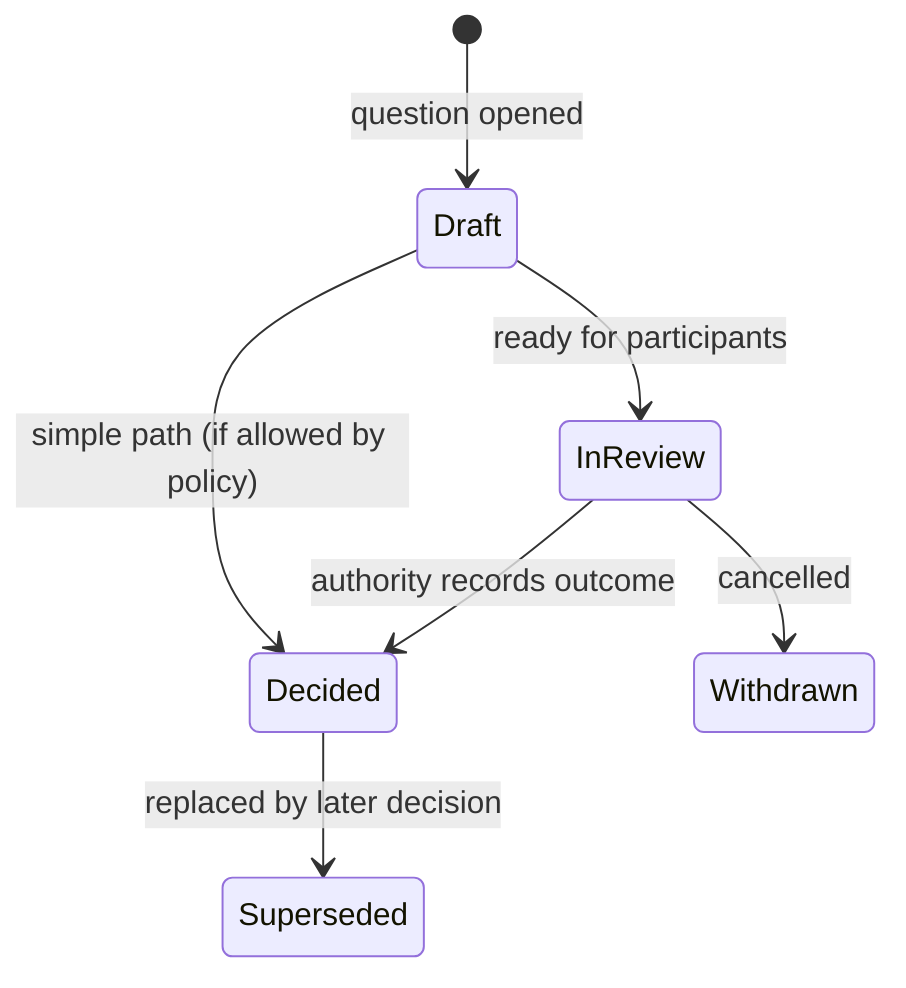

# Decision Management

**Status:** Confirmed conceptual model  
**Related:** Governance, Lifecycle, Documents, Audit

---

## 1. Purpose

Establish Decision Making as a first-class platform capability, separate from recommendations, approvals, and stage status changes.

---

## 2. Confirmed Core Rule

> **Recommendation ≠ Decision.**

The system may present evidence and recommendations. An authorized human (or authorized multi-party process) records the governance Decision.

A PoC or Pilot must not automatically write its own binding outcome Decision.

---

## 3. Decision Record

### Confirmed conceptual fields

| Field | Description |
|---|---|
| Decision ID | Stable unique identifier |
| Question | The question requiring a decision |
| Context | Narrative/structured context |
| Options considered | Explicit option set (extensible) |
| Recommendation | Optional; who/what recommends which option and why |
| Actual decision | Chosen option / outcome |
| Rationale | Why the decision was made |
| Conditions | Constraints attached to the decision |
| Decision owner / authority | Who had authority to decide |
| Participants / approvers | Who participated |
| Evidence | Links to evidence items |
| Supporting documents | Links to document versions |
| Related risks | Links |
| Related requirements | Links |
| Related dependencies | Links |
| Timestamp | When recorded |
| History | Change/supersession trail |
| Superseded decisions | Prior decisions replaced by this one |

---

## 4. Decision Lifecycle

### Invariants

1. Once **Decided**, the recorded outcome and rationale are immutable; corrections create a superseding Decision.
2. A recommendation may change without implying a new Decision until authority acts.
3. Stage transition policies may require a Decision in `Decided` state for a specific question type.
4. Decision history remains queryable for audit and executive attention views.

---

## 5. Options Model

Options are **records**, not a frozen global enum.

Examples (non-exhaustive, non-hardcoded):

- Proceed to PoC
- Proceed to Pilot
- Proceed to Project
- Request changes
- Extend current stage
- Hold
- Stop
- Do nothing
- Scale
- Rework requirements

Initiative-type or gate policies may constrain which option sets are valid in context (**Future** configurability; MVP may provide curated option sets as configuration data).

---

## 6. Recommendation Object (Optional)

| Field | Description |
|---|---|
| Recommended option | Reference to an option |
| Recommender | Principal or system-assisted summary author |
| Summary of evidence | |
| Confidence / caveats | Optional |
| Created at | |

UI and APIs must label recommendations clearly so they cannot be mistaken for decisions.

---

## 7. Relationship to Approvals

| Approval | Decision |
|---|---|
| Attests acceptance of a subject/version | Chooses among options for a question |
| Outcome: approved / rejected / changes requested | Outcome: selected option + rationale |
| Often many slots per gate | Often one governing decision per question (may involve participants) |

A gate can require both.

---

## 8. Workflow Examples

### Example — Post-PoC

1. PoC stage completes evidence capture.
2. PoC Evaluation produces findings + optional Recommendation (“proceed to Pilot”).
3. Decision record opened: “What is the next investment path?”
4. Options: Pilot / Project / Rework / Stop.
5. Authority records Decision = Pilot with conditions.
6. Gate allows transition to Pilot.
7. Audit stores Decision + linked evidence package revision.

### Example — Supersession

1. Decision D1 = Hold for 30 days.
2. New information arrives.
3. Decision D2 supersedes D1 = Proceed to Pilot.
4. D1 remains visible as superseded; dashboards use D2 as current.

---

## 9. Executive Visibility

Pending decisions are first-class attention items:

- decision required
- overdue decision
- decision blocked waiting on evidence
- recently decided (for “what changed?”)

Drill-down opens the Decision record, not a generic task list.

---

## 10. Permissions

| Action | Capability direction |
|---|---|
| Create decision question | Stage owners / managers in scope |
| Add recommendation | Eligible contributors / evaluators |
| Record decision | Authority binding for that decision type/scope |
| Supersede decision | Authority + audit |
| View | Scoped read; senior managers may have broader read |

---

## 11. Edge Cases

| Case | Direction |
|---|---|
| Decision without recommendation | Allowed |
| Recommendation without decision | Allowed; gate may still block transition |
| Disagreement among participants | Recorded in comments/participant inputs; authority still decides unless policy defines multi-signature Decision (**Open**) |
| Decision contradicts approval | Policy should prevent inconsistent gate pass; exact resolution **Open** |
| System-suggested option | Must be labeled as suggestion/recommendation only |

---

## 12. Acceptance Criteria

- Decision is first-class with required fields covered.
- Recommendation separated.
- PoC/Pilot cannot auto-decide.
- Supersession and auditability defined.
- Options extensible.
- Attention-queue integration defined.

---

## 13. Non-Goals

- Fully automated decision agents as authority.
- Replacing human accountability with score thresholds alone.
- Hardcoding one organization’s decision catalog permanently in code.
