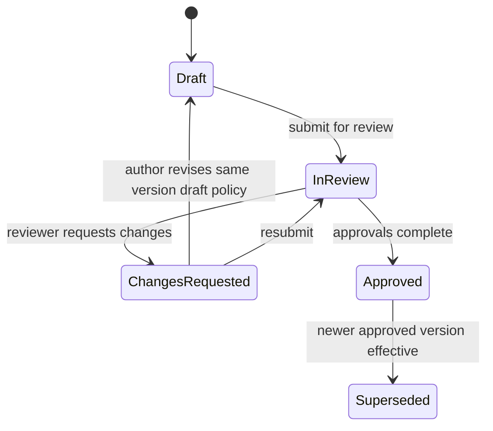

# Document Management

**Status:** Confirmed conceptual model  
**Related:** Governance, Decisions, Lifecycle, Audit

---

## 1. Purpose

Define documentation as a first-class capability via an initiative **Documentation Hub**, with versioning and approval semantics that prevent silent mutation of approved content.

---

## 2. Confirmed Principles

1. Documentation is not an unstructured attachment dump.
2. Each initiative has a Documentation Hub.
3. Documents have logical identity + immutable approved versions.
4. Lifecycle and approval status are explicit.
5. Relationships to decisions, requirements, stages, and evidence are first-class.
6. Approved content must not silently change while retaining previous approval.

---

## 3. Documentation Hub

The Hub is the canonical index of documents for an initiative (and may later surface project-level docs without duplication).

### Possible categories (configuration examples, not exclusive hardcoded set)

- Business
- Requirements
- Pre-study
- Architecture
- Security
- PoC
- Pilot
- Decisions
- Project / Delivery

Categories must be extensible.

---

## 4. Entities

### 4.1 Document (logical)

| Field | Description |
|---|---|
| Document ID | Stable logical identity |
| Title | |
| Type / category | Configurable |
| Owner | |
| Current version pointer | To latest relevant version (define policy) |
| Relationships | To stage, requirement, decision, etc. |

### 4.2 Document Version

| Field | Description |
|---|---|
| Version ID | Immutable identity |
| Version label | e.g., 0.1, 1.0 — scheme **Open** |
| Content reference | Storage pointer (file/object) + metadata |
| Lifecycle status | Draft / In Review / Changes Requested / Approved / Superseded |
| Approval status | Derived from approval records and lifecycle |
| Effective date | When approved version becomes effective |
| Created by / at | |
| Change summary | |
| Hash / checksum | Recommendation for integrity |

### 4.3 Document Relationship

Links a document/version to:

- related decision
- related requirement
- related stage
- related evidence package item
- related project/work item (**Future** breadth)

---

## 5. Document Lifecycle

### Confirmed semantics

| Status | Meaning |
|---|---|
| Draft | Editable working content |
| In Review | Locked for content edits (recommendation) awaiting approvals |
| Changes Requested | Review outcome; returns to authoring flow |
| Approved | Binding version for governance references |
| Superseded | Previously approved; retained for history |

### Hard rule

**In-place edit of an Approved version’s content is forbidden.**  
Any change requires a new version that starts as Draft (or Changes Requested flow) and must be re-approved to become Approved.

Pending approvals bound to an older in-review version are cancelled/superseded when a replacement version is submitted.

---

## 6. Approval Binding

Approvals reference a **Document Version ID**, never only the logical Document ID.

Consequences:

- Approving v1 does not approve v2.
- Evidence packages should reference specific versions.
- Gates evaluate completeness against required approved versions where configured.

---

## 7. Storage Architecture (Recommendation)

| Concern | Direction |
|---|---|
| Metadata | PostgreSQL (typed persistence) |
| Binary content | Object storage (provider-portable abstraction) |
| Vercel | Initial host; storage interface must not assume Vercel-only blob APIs in domain layer |
| Local dev | Local filesystem or MinIO-like service (**Open** exact choice) |

Domain code depends on a storage port/adapter, not a single vendor SDK sprinkled through modules.

---

## 8. Hub UX Expectations

- Filter by category, status, owner, stage.
- Show approval state and effective version clearly.
- Progressive disclosure: list → version history → relationships.
- Contextual appearance on stage pages without creating a second document store.

---

## 9. Edge Cases

| Case | Direction |
|---|---|
| Multiple documents In Review | Allowed |
| Approve then find typo | New version; optional “editorial correction” policy **Open** |
| Delete approved document | Soft-archive only; hard delete restricted |
| External links as documents | Allowed as a type; integrity weaker — mark clearly |
| Very large files | NFR limits **Open** |

---

## 10. Permissions

| Action | Direction |
|---|---|
| Create draft | Contributors with initiative scope |
| Submit review | Owner / authorized editor |
| Approve | Governance authority per policy |
| Supersede / archive | Elevated permission |
| Configure categories | Admin |

---

## 11. Acceptance Criteria

- Hub concept defined.
- Version/approval lifecycle defined.
- No silent approved mutation.
- Relationships defined.
- Categories extensible.
- Storage portability noted.

---

## 12. Non-Goals

- Full DMS/ECM replacement (records retention schedules, legal hold) in MVP.
- Collaborative real-time document editing in MVP (**Future**).
- Hardcoding a single company’s document template library as required seed data.
