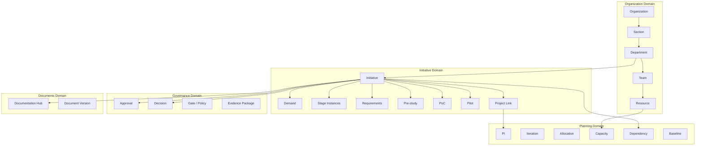
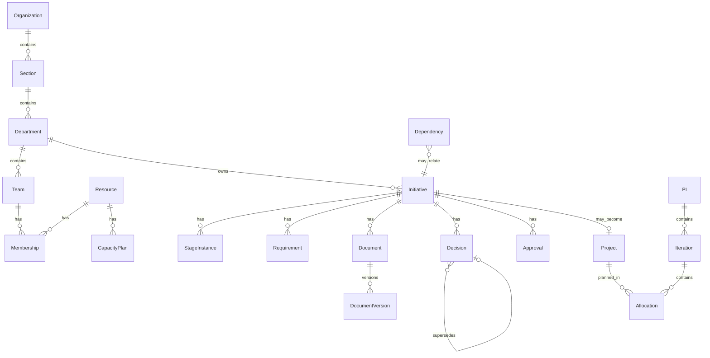

# Domain Model

**Status:** Conceptual domain model (Phase 0)  
**Persistence mapping:** Deferred to implementation; this document is technology-agnostic

---

## 1. Purpose

Define the core entities, relationships, invariants, and extensibility rules for the Management & PI Planning Platform.

This is a **conceptual** model. Physical schema design occurs in later phases.

---

## 2. Modeling Principles

### Confirmed

1. **Canonical ownership** — each key concept has one authoritative record; other views reference it.
2. **Extensibility over hardcoding** — categories, decision types, alternative options, approval rules are configurable/data-driven where product direction requires it.
3. **No business seed dependency** — empty tenant/organization must be operable after configuration, without hardcoded demo entities.
4. **History preservation** — lifecycle conversion and baselines do not discard prior stage history.
5. **Separation of recommendation and decision**.
6. **Separation of PoC and Pilot**.

### Recommendation

Prefer explicit aggregate boundaries aligned with modular-monolith domains (see [ARCHITECTURE.md](./ARCHITECTURE.md)).

---

## 3. Domain Map

---

## 4. Organization Domain

### 4.1 Entities

| Entity | Description |
|---|---|
| **Organization** | Top-level tenant boundary for data and configuration |
| **Section** | Organizational unit containing multiple departments that plan together |
| **Department** | Management area with managers, teams, resources, projects, budgets |
| **Team** | Grouping of resources within a department |
| **Resource** | Capacity-bearing unit (person or extensible non-person capacity entity) |
| **Membership** | Association of a resource to team/department with effective dates |
| **Skill/Capability** | Taggable capability associated to a resource |
| **Availability Window** | Periods of availability / unavailability affecting capacity |

### 4.2 Resource minimum attributes

Confirmed minimum:

- identity / reference
- role (assignment; not a hardcoded global identity)
- skills/capabilities
- availability
- capacity
- department/team membership

### 4.3 Invariants

- A Team belongs to exactly one Department (initial model).
- A Department belongs to exactly one Section (initial model).
- Resource membership must be scopable for authorization.
- Deleting org units that own historical initiatives is restricted or soft-archived (**Open:** hard delete policy).

### 4.4 Open

- Whether a Resource may belong to multiple teams concurrently.
- Whether Sections can nest (currently: no nesting assumed).
- Multi-organization (SaaS multi-tenant) vs single-org deployment for v1.

---

## 5. Identity & Access Entities (Conceptual)

| Entity | Description |
|---|---|
| **Principal** | Authenticated identity (user account) |
| **Role Definition** | Named permission bundle (configurable) |
| **Role Binding** | Principal ↔ Role within a scope (org/section/department/…) |
| **Permission** | Atomic authorization unit |
| **Scope** | Resource boundary for a binding |

See [ROLES-AND-PERMISSIONS.md](./ROLES-AND-PERMISSIONS.md).

**Confirmed:** No hardcoded admin emails, special users, or pre-seeded departments in product logic.

---

## 6. Initiative Domain

### 6.1 Initiative

An **Initiative** is the enduring container spanning demand through delivery history.

| Attribute (conceptual) | Notes |
|---|---|
| ID | Stable unique identifier |
| Title | |
| Current stage | Reference to active stage instance |
| Owning department | Requesting/owning org unit |
| Business owner | Principal or role-scoped assignment |
| Status | Initiative-level status distinct from stage internals |
| Priority / urgency | |
| Strategic alignment | Structured or referential, not free-text-only long term |
| Created/updated | |

### 6.2 Stage Instance

Stages are **instances**, not enums alone.

Each stage instance may contain:

- work items
- structured stage data
- documents
- evidence items
- assessments
- risks
- dependencies (links)
- approvals
- decisions
- comments/history
- responsible owners
- completion criteria

### 6.3 Demand

Capture fields (confirmed minimum): title, requesting department, requester, business owner, problem/opportunity, reason for request, expected value, affected users/areas, urgency, strategic alignment, initial impact, attachments/documents.

Demand is reviewable before progression.

### 6.4 Requirement

| Attribute | Notes |
|---|---|
| Unique ID | Human-readable + system ID |
| Title / description | |
| Category/type | Configurable set; seeded defaults allowed as *configuration templates*, not business data |
| Priority | |
| Owner | |
| Source | |
| Status | |
| Acceptance criteria | |
| Relationships | to other requirements / need / work |
| Review/approval state | |
| Trace links | forward/back |

Default category examples (configuration, not hardcoded exclusive set): Business, Functional, Non-functional, Architecture, Security, Integration, Data, Compliance, Other.

### 6.5 Pre-study

Supports assessments and **extensible alternatives** comparison. Alternatives are records (label, description, cost/risk summary, recommendation flag)—not a frozen product enum.

### 6.6 PoC

Hypothesis/evidence-focused stage entity. Does not auto-emit a binding Decision outcome.

### 6.7 Pilot

Scale-readiness stage entity, distinct from PoC.

### 6.8 Project

Portfolio entity that may originate from an initiative after governance. Conversion **links** history; it must not fork an amnesiac duplicate.

---

## 7. Governance Domain

### 7.1 Approval

First-class record. See [GOVERNANCE-AND-APPROVALS.md](./GOVERNANCE-AND-APPROVALS.md).

### 7.2 Decision

First-class record. Recommendation is optional related content, not the decision itself. See [DECISION-MANAGEMENT.md](./DECISION-MANAGEMENT.md).

### 7.3 Gate / Evidence Package

Configurable definition of mandatory/optional evidence for a stage transition. Completeness is evaluable.

---

## 8. Document Domain

| Entity | Description |
|---|---|
| **Documentation Hub** | Initiative-scoped document index |
| **Document** | Logical document identity |
| **Document Version** | Immutable (or append-only) version payload metadata |
| **Document Relationship** | Links to decisions, requirements, stages, etc. |

Lifecycle: Draft → In Review → Changes Requested → Approved → Superseded.

**Invariant:** An Approved version cannot be silently edited in place.

---

## 9. Planning Domain

| Entity | Description |
|---|---|
| **PI** | Planning Increment definition |
| **Iteration / Timebox** | Subdivision of a PI |
| **Backlog Item / Work Item** | Plannable unit |
| **Allocation** | Assignment of work to team/resource/timebox |
| **Capacity Plan** | Capacity for team/resource per timebox |
| **Planning Conflict** | Detected problem (overload, missing dependency date, etc.) |
| **Baseline / Snapshot** | Immutable planning or governance snapshot |
| **Dependency** | First-class relationship with status, owner, needed-by, criticality |

### Dependency directions (eventual)

- project → project
- work item → work item
- department → department impact
- cross-team

**Invariant:** One source of truth; modules display references, not independent copies.

---

## 10. Cost / Budget (Model Readiness)

Conceptual fields on relevant entities (initiative/project/stage estimates):

- estimated cost
- approved budget
- planned cost
- actual cost (where available)
- forecast
- variance

**Non-goal:** full ledger/ERP.

---

## 11. Risk & Milestone (Canonical)

Risks and milestones are canonical entities that can be linked from initiatives, stages, projects, and PI views.

Avoid duplicate independent milestone systems per screen.

---

## 12. Audit

Material domain events emit structured audit records (actor, action type, subject refs, before/after or payload, timestamp, correlation). See [AUDIT-AND-BASELINES.md](./AUDIT-AND-BASELINES.md).

---

## 13. Relationship Summary (Selected)

---

## 14. Cross-Cutting Invariants

1. Stage transition requires satisfying configured gate rules (or explicit controlled exception with audit).
2. PoC completion ≠ Project approval.
3. Pilot completion ≠ automatic scale decision.
4. Approved DocumentVersion is immutable content; changes create new version and reset approval state.
5. Role bindings are scoped; global unbounded admin should be explicit and auditable.
6. Baselines are reproducible; current mutable state is not the sole history.

---

## 15. Non-Goals of This Model

- Physical table design
- Exact Prisma schema
- UI component mapping
- Hardcoded reference data for a specific real organization

---

## 16. Open Questions

- Final ID schemes (human-readable per org).
- Soft-delete vs archive semantics per entity.
- Whether “Feature/work item” is a single type hierarchy or multiple.
- Currency and multi-currency needs for cost fields.
