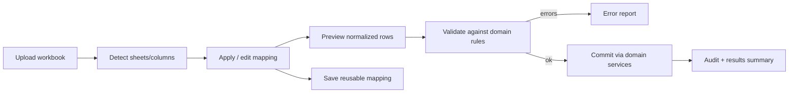

# Excel Migration (Future Architecture)

**Status:** Future capability — **not implemented in Phase 0**  
**Related:** Architecture, MVP Roadmap, Domain Model

---

## 1. Purpose

Document requirements and architecture direction for migrating fragmented Excel-based planning into the platform—without implementing import now.

---

## 2. Confirmed Future Capability

The platform should eventually support:

- Excel import
- sheet detection
- column detection
- mapping
- preview
- validation
- error reporting
- reusable import mappings

---

## 3. Goals

1. Reduce switching cost from spreadsheet processes.
2. Write through **domain services** (respecting authZ, validation, audit)—not raw table loads that bypass governance.
3. Make mappings reusable across recurring planning cycles.
4. Provide clear preview and error reporting before commit.

---

## 4. Non-Goals (Import Feature)

- Becoming a full spreadsheet application.
- Silently inventing org entities without user confirmation.
- Implementing import in Phase 0 or necessarily in MVP (MVP excludes import unless later promoted).

---

## 5. Logical Pipeline

---

## 6. Mapping Model (Conceptual)

| Concept | Description |
|---|---|
| Import Mapping | Named mapping bound to a workbook “kind” (capacity, backlog, dependencies, etc.) |
| Sheet Rule | How to select sheets (name pattern / index) |
| Column Map | Source column → target domain field |
| Transform | Optional parse rules (dates, numbers, enums) |
| Entity Resolution | How names map to departments/teams/resources/projects (match policy) |

### Confirmed constraint alignment

Mappings must not embed hardcoded real-world identities in source code. They are configuration/data owned by the organization.

---

## 7. Validation Categories

- schema/type errors
- missing required fields
- unknown references (team/resource not found)
- authorization failures (importer lacks scope)
- domain invariant violations (duplicate IDs, negative capacity)
- ambiguous matches requiring user choice

---

## 8. Architectural Placement

**Recommendation:** `Import` as a separate module that:

- parses files;
- produces domain commands;
- calls Organization/Planning/Initiative application services;
- emits audit events for import jobs and commits.

Storage of uploaded workbooks via the same object-storage port as documents.

---

## 9. Security Considerations

- Malicious file parsing limits (size, zip bombs for xlsx).
- Virus scanning **Open**/Later depending on environment.
- Importers restricted by authZ scopes.
- Preview must not persist business entities until commit (except staging tables clearly marked).

---

## 10. Acceptance Criteria (for future implementation phase)

- End-to-end detect → map → preview → validate → commit path.
- Reusable mappings.
- Error reporting actionable by managers/admins.
- Domain invariants and authZ preserved.
- No requirement for hardcoded demo sheets in production.

---

## 11. Open Questions

- Which Excel processes are first-priority (capacity, backlog, dependencies, cost)?
- Excel 365 cloud sync vs file upload only?
- Whether export round-trip is required with import v1.
