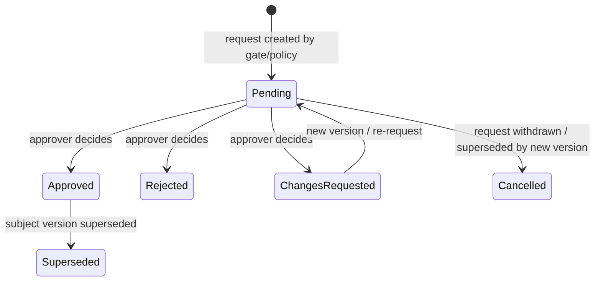

# Governance and Approvals

**Status:** Confirmed governance model (conceptual)  
**Related:** Decision Management, Documents, Lifecycle, Roles

---

## 1. Purpose

Define approvals and governance gates as first-class, auditable platform capabilities—not boolean flags.

---

## 2. Confirmed Principles

1. **Approvals are records**, not only `approved = true`.
2. **Gates evaluate evidence + required authorities**.
3. **Rules are configurable**; org-specific matrices must not be hardcoded into product source as permanent logic.
4. **Outcomes are explicit** (approved / rejected / changes requested at minimum).
5. **Version matters** — approving a subject approves a specific version/snapshot where applicable.
6. **Recommendation does not approve** — humans with authority do.

---

## 3. Core Entities

### 3.1 Approval Request / Approval Record

Conceptual fields:

| Field | Description |
|---|---|
| Approval ID | Stable identifier |
| Subject | What is being approved (initiative stage, document version, baseline, skip request, etc.) |
| Stage / Gate | Lifecycle gate context |
| Required authority / role | Capability required to approve |
| Approver identity | Principal who acted (when decided) |
| Status | e.g., pending, approved, rejected, changes_requested, cancelled, superseded |
| Requested at | |
| Decided at | |
| Comments | |
| Version being approved | Document version, evidence package revision, planning baseline ID, etc. |
| Outcome | Normalized outcome value |
| Conditions | Optional conditions attached to an approval |
| Policy reference | Which governance rule created this requirement |

### 3.2 Gate Definition

Configurable definition bound to a transition or action:

- required evidence item types
- required approval slots
- conditional approval slots
- required decision presence (if any)
- blocking vs advisory checks (**Open:** advisory gates in MVP?)

### 3.3 Evidence Package

A gate-specific checklist of evidence items with completion state.

Example (illustrative only — **not** a hardcoded universal checklist):

```text
Business Case             Complete
Requirements Baseline     Complete
Architecture Assessment   Complete
Security Assessment       Complete
Cost Estimate             Complete
Risk Assessment           Complete
PoC Result                Complete
Pilot Result              Missing
```

The platform must be able to determine whether **mandatory** evidence for a configured gate is complete.

---

## 4. Approval Outcomes

### Confirmed minimum set

- Approved
- Rejected
- Changes requested

### Future / extensible

- Approved with conditions
- Delegated
- Escalated
- Abstain (if multi-approver voting models appear — **Open**)

---

## 5. Required vs Conditional Approvals

### Design direction (Confirmed)

Support generic rule shapes:

**Required**

- slots that must be satisfied for the gate to pass

**Conditional**

- slots activated by predicates (e.g., cost above threshold; data classification triggers privacy review)

### Explicit non-goal for Phase 0 / early MVP hardcoding

Do **not** encode the following as permanent source-level business rules:

- Business Owner always required
- Department Manager always required
- Architecture always required
- Security always required
- Finance if cost > X
- Privacy if classification = Y

These are **examples** of configurable policies.

---

## 6. Lifecycle of an Approval



### Invariants

- An approval outcome is immutable once finalized; corrections create new records or explicit supersession.
- Approving version N does not automatically approve version N+1.
- Cancelling pending approvals on subject change must be auditable.

---

## 7. Relationship to Decisions

| Concept | Role |
|---|---|
| Approval | Authority attests a subject meets criteria / is accepted |
| Decision | Chooses among options for a governance question |

A gate may require:

- one or more Approvals, and/or
- a Decision record with a recorded outcome.

They are complementary, not interchangeable.

Example: PoC Evaluation may be “approved as complete evidence,” while a separate Decision answers “proceed to Pilot or stop?”

---

## 8. Workflow Examples

### Example A — Pre-study gate (illustrative configuration)

1. Evidence package requires: business summary, options comparison, cost estimate, risk summary.
2. Required approval slots: Business Owner, Department Manager.
3. Conditional: Architecture if “architecture impact” flag true.
4. On all approvals = Approved → transition allowed.
5. If any Rejected → transition blocked; initiative may enter rework path.
6. If Changes Requested → subject returns to editable state; prior pending approvals cancelled/superseded.

### Example B — Document approval

1. Document Version enters In Review.
2. Approval records created per policy.
3. On Approved → version lifecycle becomes Approved.
4. Later edit creates new Draft version; previous Approved remains historical.

### Example C — Controlled stage skip

1. Skip request created with rationale and target path.
2. Approval(s) required per skip policy.
3. On approval, transition executes with audit including skipped stages.

---

## 9. Permissions (Conceptual)

| Action | Typical capability |
|---|---|
| Create approval request | System/policy on transition attempt; or authorized requester |
| Decide approval | Principals matching required authority in scope |
| View approval history | Scoped read |
| Configure gate policies | Administrator / governance admin capability |
| Override / exception | Explicit privileged capability + mandatory rationale + audit |

Exact role names are not prescribed. See [ROLES-AND-PERMISSIONS.md](./ROLES-AND-PERMISSIONS.md).

---

## 10. Edge Cases

| Case | Direction |
|---|---|
| Approver loses role mid-pending | Request remains; reassignment policy **Open** |
| Multiple parallel approvers | All-required vs quorum **Open**; model must allow policy expression |
| Evidence marked complete then removed | Completeness re-evaluated; may reopen gate |
| Approval of wrong version | Prevent by binding Approval to immutable version IDs |
| External approver without login | **Open** (out of MVP assumed) |

---

## 11. Acceptance Criteria

- Approval is a first-class auditable record.
- Boolean-only approval modeling is rejected.
- Version binding specified.
- Configurable required/conditional rules specified as design direction.
- No org-specific matrices hardcoded as product constants.
- Evidence package completeness concept defined.
- Relationship to Decision clarified.

---

## 12. Non-Goals

- Shipping a full visual policy builder in MVP.
- Legal e-signature provider integration in MVP (**Open** later).
- Encoding finance/privacy thresholds in source code.
