# Governance Behavior Contract (Phase 1A)

**Status:** AS-IS guaranteed behavior locked for Phase 1B  
**Baseline:** `main` at M0 (`46e91367…` and successors)  
**Source of truth (runtime):** `GovernanceService` + Prisma models + integration characterization suites  
**Non-goals:** This document does **not** prescribe future UX, new gates, or improved semantics. It records what the platform does today so Phase 1B can refactor structure without changing observable behavior.

Related docs: [GOVERNANCE-AND-APPROVALS.md](./GOVERNANCE-AND-APPROVALS.md), [DECISION-MANAGEMENT.md](./DECISION-MANAGEMENT.md), [PHASE-3-IMPLEMENTATION.md](./PHASE-3-IMPLEMENTATION.md), [PHASE-4-IMPLEMENTATION.md](./PHASE-4-IMPLEMENTATION.md), [authorization-matrix.md](./authorization-matrix.md), ADR-022.

---

## 1. Lifecycle relationship

```text
Demand → Requirements → Pre-study
        → PRE_STUDY_GATE (submit → approvals → decision)
        → explicit createPoC → stage POC
        → POC_GATE
        → explicit createPilot → stage PILOT
        → PILOT_GATE
        → explicit convertToProject → stage PROJECT
```

Hard rules (AS-IS):

- Gate decisions do **not** auto-create PoC, Pilot, or Project.
- Stage advances to `POC` / `PILOT` / `PROJECT` only inside the explicit create/convert operations.
- PoC, Pilot, and Project remain linked to the **same** Initiative (`initiativeId` unique on each).

---

## 2. Gate types

| GateType | Typical stage at submit | Progression after positive decision |
|---|---|---|
| `PRE_STUDY_GATE` | `PRE_STUDY` | Explicit `createPoC` → stage `POC` |
| `POC_GATE` | `POC` | Explicit `createPilot` → stage `PILOT` |
| `PILOT_GATE` | `PILOT` | Explicit `convertToProject` → stage `PROJECT` |

Each initiative+gateType has a durable `GovernanceGate`. Submissions are revisioned under that gate.

---

## 3. Readiness

Readiness is **derived** (never a stored “ready” flag):

| Gate | Policy | Required (summary) |
|---|---|---|
| Pre-study | `evaluatePreStudyReadiness` | Demand complete; ≥1 accepted requirement; all required assessment areas COMPLETE; ≥1 alternative; ≥1 risk |
| PoC | `evaluatePoCReadiness` | Status EVALUATION/COMPLETED; definition fields; ≥1 required criterion evaluated; results + findings |
| Pilot | `evaluatePilotGovernanceReadiness` | Status EVALUATION/COMPLETED; definition/start fields; required criteria evaluated; results + business/technical/operational findings |

Incomplete / wrong lifecycle position → submit rejected (`VALIDATION`).

---

## 4. Submission / snapshot semantics

On successful submit (`createSubmission` private path):

| Artifact | Behavior |
|---|---|
| `GovernanceSubmission` | New revision; status enters review |
| `ReviewSnapshot` | **Immutable** JSON of workspace at submit time |
| `EvidencePackage` + entries | Derived from snapshot (presence metadata, no blobs) |
| `ApprovalRequest` rows | From active `ApprovalRequirementTemplate` seeds |
| `DecisionPackage` | Question + optional `recommendationText` (not a decision) |

**Immutability contract:** Mutating Initiative/Demand/PoC/Pilot **after** submit must not change the existing `ReviewSnapshot.payload`. Revise after `CHANGES_REQUESTED` creates a **new** snapshot; prior rows remain.

Audit: `governance.submission.created`.

---

## 5. Approval semantics

```text
ApprovalRequest → recordApproval → ApprovalRecord
```

| Rule | AS-IS |
|---|---|
| Permission | `approval.review` + matching `approval.authority.*` for the request’s authority key |
| Outcomes | `APPROVED` \| `REJECTED` \| `CHANGES_REQUESTED` |
| Immutability | Completed requests cannot receive a second `recordApproval` (`CONFLICT`) |
| REJECTED | Cancels remaining pending requests on that submission |
| CHANGES_REQUESTED | Sets submission status; revise creates new revision |
| All required APPROVED | Submission → `APPROVALS_COMPLETE` |
| `assignedPrincipalId` | Schema field exists; **unused** on submit path (remains `null`). Inbox is permission-based, not assignee-based. |
| Versioning | Stale `expectedVersion` → `STALE_VERSION` |

Audit: `governance.approval.recorded` (subject `ApprovalRecord`).

---

## 6. Decision semantics

```text
APPROVALS_COMPLETE → recordDecision → DecisionRecord (+ optional DecisionCondition)
```

| Rule | AS-IS |
|---|---|
| Permission | `decision.make` |
| Premature | Not `APPROVALS_COMPLETE` → `VALIDATION` |
| Duplicate | After first decision, submission status is `DECISION_RECORDED`, so a second `recordDecision` is rejected with `VALIDATION` (status guard runs before the `decisionRecord` `CONFLICT` branch). First `DecisionRecord` remains unchanged. |
| Recommendation | Package / input `recommendationText` is informational; **never** auto-copied into `outcome` |
| Immutability | No update API for DecisionRecord; history is append-only per submission (one record) |
| Gate | `status` → `DECIDED`; submission → `DECISION_RECORDED` |

Audit: `governance.decision.recorded` (payload includes `outcome`, `submissionId`, `gateType`).

---

## 7. Decision outcome matrix

Service allow-lists (`allowedOutcomesForGate`):

| Gate | Outcome | Allowed? | Initiative effect | Progression object |
|---|---|---:|---|---|
| PRE_STUDY_GATE / POC_GATE | GO | Yes | Stage/status unchanged by decision | None auto-created |
| PRE_STUDY_GATE / POC_GATE | CONDITIONAL_GO | Yes (≥1 condition) | Unchanged by decision | None; blocking OPEN conditions block createPoC/createPilot |
| PRE_STUDY_GATE / POC_GATE | NO_GO | Yes | `status=CANCELLED` | No PoC/Pilot |
| PRE_STUDY_GATE / POC_GATE | HOLD | Yes | `status=ON_HOLD` | No PoC/Pilot |
| PRE_STUDY_GATE / POC_GATE | SCALE / EXTEND_PILOT / STOP / CONDITIONAL_SCALE | **No** | — | `VALIDATION` |
| PILOT_GATE | SCALE | Yes | `status=ACTIVE` | No Project (needs convert) |
| PILOT_GATE | CONDITIONAL_SCALE | Yes (≥1 condition) | `status=ACTIVE` | Blocking OPEN conditions block convert |
| PILOT_GATE | EXTEND_PILOT | Yes (requires `extension`) | `ACTIVE`, stage stays `PILOT`; PilotExtension + plannedEnd update | No Project |
| PILOT_GATE | STOP | Yes | `status=CANCELLED` | No Project |
| PILOT_GATE | HOLD | Yes | `status=ON_HOLD` | No Project |
| PILOT_GATE | GO / CONDITIONAL_GO / NO_GO | **No** | — | `VALIDATION` |

Zod accepts the full enum; gate filtering is enforced in `GovernanceService.recordDecision`.

---

## 8. Conditional decisions

`CONDITIONAL_GO` / `CONDITIONAL_SCALE`:

- Require ≥1 `DecisionCondition` at record time (empty → `VALIDATION`).
- Conditions start `OPEN`.
- `requiredBeforeProgression: true` + `OPEN` blocks `createPoC` / `createPilot` / `convertToProject`.
- `resolveDecisionCondition` updates status (`RESOLVED` / etc.) with permission `decision.condition.resolve`.
- Condition `ownerName` is a label (not authorization).
- Non-blocking conditions do not gate progression (AS-IS filter is only blocking+OPEN).

Audit: `governance.decision.condition.resolved`.

---

## 9. PoC behavior

Public operations: `createPoC`, `updatePoC`, `transitionPoC`, `upsertPoCCriterion`, `updateCriterionEvaluation`, `updatePoCResults`, `submitPoCForGovernance`.

| Concern | AS-IS |
|---|---|
| Prerequisite | Latest pre-study decision GO/CONDITIONAL_GO; blocking conditions resolved; stage `PRE_STUDY` |
| Identity | Unique `initiativeId`; same Initiative |
| Status | Adjacent forward: DRAFT→READY→IN_PROGRESS→EVALUATION→COMPLETED |
| Ownership | Optional `ownerResourceId` + name snapshot (ADR-021); not auto-copied from Initiative |
| Recommendation | No PoC-level recommendation field; gate recommendation lives on DecisionPackage |
| Audit | `poc.created`, `poc.updated`, `poc.transitioned`, `poc.criterion.*`, `poc.results.updated` |

---

## 10. Pilot behavior

Public operations: `createPilot`, `updatePilot`, `transitionPilot`, `upsertPilotCriterion`, `evaluatePilotCriterion`, `updatePilotResults`, `addPilotFeedback`, `submitPilotForGovernance`.

| Concern | AS-IS |
|---|---|
| Prerequisite | Latest PoC-gate GO/CONDITIONAL_GO; blocking conditions resolved; stage `POC` |
| Identity | Unique `initiativeId` |
| Status | Same adjacent-forward pattern as PoC |
| EXTEND_PILOT | Creates `PilotExtension`; updates `plannedEnd`; retains criteria/history |
| Audit | `pilot.created`, `pilot.updated`, `pilot.transitioned`, `pilot.criterion.*`, `pilot.results.updated`, `pilot.feedback.added` |

---

## 11. Project conversion

`convertToProject`:

| Check | Behavior |
|---|---|
| Existing Project | `CONFLICT` (“already exists”) |
| Decision | Latest pilot decision must be SCALE or CONDITIONAL_SCALE |
| Conditions | Blocking OPEN → `VALIDATION` |
| Stage | Must be `PILOT` |
| Owner | Explicit convert input only — **does not** invent copy from Initiative business owner |
| Atomicity | `$transaction`: Project create + Initiative stage→PROJECT + LifecycleTransition |
| Idempotency | Unique `Project.initiativeId` + app-level CONFLICT; **COUNT(Project where initiativeId=X) ≤ 1** |
| Audit | `project.converted` |

---

## 12. Authorization boundaries

Governance permissions are role/scope based (Phase 0C / ADR-022).

Business ownership (`INITIATIVE_BUSINESS_OWNER` / `PROJECT_OWNER`) grants **only**:

- `initiative.view` / `initiative.edit`
- `project.view` / `project.edit`

Ownership does **not** grant:

- `approval.review`
- `decision.make`
- `governance.submit`
- governance policy / role management
- PoC/Pilot create (those require explicit permissions)

Organization boundaries remain enforced (cross-org → `FORBIDDEN`).

---

## 13. Audit behavior (critical actions)

| Action | actionType | subjectType (typical) | Key payload |
|---|---|---|---|
| Submit | `governance.submission.created` | GovernanceSubmission | initiative / gate context |
| Approval | `governance.approval.recorded` | ApprovalRecord | outcome context |
| Decision | `governance.decision.recorded` | DecisionRecord | `outcome`, `submissionId`, `gateType` |
| Condition resolve | `governance.decision.condition.resolved` | DecisionCondition | status |
| PoC create/update/… | `poc.*` | PoC / criterion | ids / version |
| Pilot create/update/… | `pilot.*` | Pilot / … | ids / version |
| Convert | `project.converted` | Project | `initiativeId`, `referenceKey` |
| Policy template | `governance.policy.template.updated` | template | supersede metadata |

Exact incidental JSON formatting is not a contract; actor, actionType, subject, and key business fields are.

---

## 14. Transaction boundaries

| Operation | `$transaction`? | Notes |
|---|---|---|
| `createSubmission` (submit/revise) | Yes | Snapshot + submission + evidence + requests + package |
| `recordApproval` | Yes | Record + request/submission status updates |
| `recordDecision` | Yes | Decision (+conditions) + submission/gate + initiative/pilot side effects |
| `createPoC` / `createPilot` | Yes | Entity + stage transition |
| `convertToProject` | Yes | Project + initiative stage + lifecycle transition |
| `updateApprovalTemplate` | Yes | Supersede active template |
| Other updates/transitions | No | Single-row updates with optimistic version |

**Phase 1B note (do not fix in 1A):** Audit writes typically occur **after** the transaction commits. A failed audit after success leaves domain state committed without audit (existing pattern across services). Decision/create/convert domain mutations themselves are atomic within their transactions.

---

## 15. Known inconsistencies / debt

1. **`ApprovalRequest.assignedPrincipalId` unused** — permission inbox only.
2. **GovernanceService overload** — Resolved structurally in Phase 1B (facade + Core/PoC/Pilot/Conversion). Physical `experimentation` package still deferred.
3. **Audit outside transactions** — see §14.
4. **Zod vs service outcome allow-list** — schema accepts all outcomes; service rejects wrong gate.
5. **Docs vs code:** Product docs may describe aspirational assignee workflows; runtime behavior is permission-based (this contract wins for Phase 1B).
6. **No PoC/Pilot recommendation entity field** — recommendations are DecisionPackage / DecisionRecord text only.

---

## 16. Public API contract (Phase 1B facade — implemented)

Public signatures on `GovernanceService` are unchanged. Implementation location after Phase 1B:

| Method group | Implementation |
|---|---|
| `ensureTemplates`, submit*/revise, `recordApproval`, `recordDecision`, `resolveDecisionCondition`, templates, governance queries | `GovernanceCoreService` |
| PoC create/update/transition/criteria/results | `PoCService` |
| Pilot create/update/transition/criteria/results/feedback | `PilotService` |
| `convertToProject` | `ProjectConversionService` |
| All of the above public names | Delegated by `GovernanceService` facade |

Callers (Server Actions, tests, InitiativeService) continue to use the facade.

---

## 17. Database entity ownership (current writes)

| Entity | Governance Core | PoC | Pilot | Conversion | Read only |
|---|---:|---:|---:|---:|---:|
| GovernanceGate | W | | | | |
| GovernanceSubmission | W | | | | |
| ReviewSnapshot | W | | | | |
| EvidencePackage / EvidenceEntry | W | | | | |
| ApprovalRequirementTemplate | W | | | | |
| ApprovalRequest / ApprovalRecord | W | | | | |
| DecisionPackage | W | | | | |
| DecisionRecord / DecisionCondition | W | | | | |
| PoC / PoCSuccessCriterion | | W | | | |
| Pilot / PilotCriterion / PilotFeedback / PilotExtension | | | W | | |
| Project (+ participating depts) | | | | W | |
| Initiative (status/stage) | W | W | W | W | |
| LifecycleTransition | | W | W | W | |
| AuditEvent | W | W | W | W | |
| Demand / Requirements / Assessments / … | | | | | R (snapshot) |

---

## 18. Service dependency map (Phase 1B)

```mermaid
flowchart LR
  SA[Server Actions] --> GS[GovernanceService facade]
  IS[InitiativeService] --> GS
  GS --> Core[GovernanceCoreService]
  GS --> PoC[PoCService]
  GS --> Pilot[PilotService]
  GS --> Conv[ProjectConversionService]
  Core --> Prisma[(PrismaClient)]
  PoC --> Prisma
  Pilot --> Prisma
  Conv --> Prisma
  Core --> Authz[AuthorizationService]
  PoC --> Authz
  Pilot --> Authz
  Conv --> Authz
  Core --> Audit[AuditService]
  PoC --> Audit
  Pilot --> Audit
  Conv --> Audit
  Core --> Ready[Readiness / snapshot leaves]
```



**Acyclic:** children do not import the facade or each other. Initiative depends on the facade only. See ADR-023.

---

## 19. Characterization test suites

| Suite | Role |
|---|---|
| `tests/integration/governance.test.ts` | Pre-study submit/approve/decide/PoC path |
| `tests/integration/pilot-project.test.ts` | Pilot, scale outcomes, conversion |
| `tests/integration/governance-characterization.test.ts` | Phase 1A gap locks (snapshot freeze, no auto-create, outcome matrix, audit, ownership≠gov, COUNT≤1) |
| `tests/integration/phase0c-authorization.test.ts` | Ownership ≠ `decision.make` |
| `tests/unit/poc-readiness.test.ts` / `pilot-readiness.test.ts` | Derived readiness |

---

## 20. Phase 1B boundaries (implemented)

Structural split (behavior unchanged). Physical package remains `src/modules/governance/application/` (logical Experimentation; see ADR-023):

```text
GovernanceService (facade)
├── GovernanceCoreService
│    ├── Gate / Submission / ReviewSnapshot / Evidence
│    ├── ApprovalRequest / ApprovalRecord / Templates
│    ├── DecisionPackage / DecisionRecord / DecisionCondition
│    └── Policy + governance queries
├── PoCService          (Experimentation — PoC ops)
├── PilotService        (Experimentation — Pilot ops)
└── ProjectConversionService  (Initiative → Project orchestration)

ProjectService (existing) — post-existence Project CRUD only
```

**Preserved:** outcome matrix, immutability, recommendation≠decision, explicit progression, conversion idempotency (≤1 Project), authorization, audit actionTypes, transaction semantics (§14).

**Deferred:** physical `experimentation` package; moving audit into transactions; wiring `assignedPrincipalId`.

---

## Behavioral coverage confidence (Phase 1A)

| Area | Confidence | Notes |
|---|---|---|
| Submission | STRONG | Existing + characterization |
| Snapshot | STRONG | Revise preserve + post-mutation freeze |
| Approval | STRONG | Auth, reject, changes, immutability, stale |
| Decision | STRONG | Outcomes, matrix rejects, duplicate, premature |
| PoC | STRONG | Lifecycle + readiness + submit |
| Pilot | STRONG | Progression + scale suite |
| Conversion | STRONG | SCALE path, COUNT≤1, ownership explicit |
| Authorization | STRONG | Phase 0C + ownership≠approval/decision/submit |
| Audit | ADEQUATE | Critical path asserted; not every poc/pilot sub-event |
| Transactions | ADEQUATE | Documented; no chaos/fault-injection tests |
