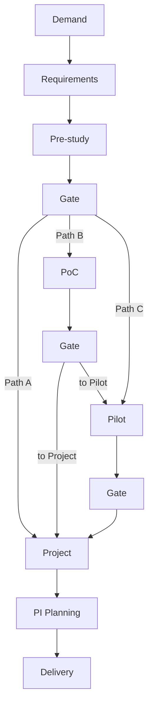

# Initiative Lifecycle

**Status:** Confirmed conceptual lifecycle model  
**Related:** Governance, Decisions, Documents, Domain Model

---

## 1. Purpose

Define the end-to-end initiative lifecycle as a governed sequence of **rich stages**, not status strings; describe optional paths, skip controls, stage contents, and completion semantics.

---

## 2. Confirmed Conceptual Sequence

```text
Demand / Idea
→ Requirement Gathering
→ Pre-study
→ Decision / Approval Gate
→ PoC
→ PoC Evaluation
→ Decision Gate
→ Pilot
→ Pilot Evaluation
→ Decision Gate
→ Project / Rollout
→ PI Planning
→ Delivery
```

### Important clarifications

| Point | Rule |
|---|---|
| Stages are containers | Each stage instance holds work, evidence, docs, risks, etc. |
| Gates are explicit | Progression depends on approvals/decisions/evidence, not only editing a field |
| Paths vary | Not every initiative executes every stage |
| Skips are controlled | Skipping is auditable and permissioned |
| PoC ≠ Pilot | Different questions and evidence |
| Evaluation ≠ Decision | Evaluation produces evidence/recommendation; Decision is separate |

---

## 3. Stage Catalog

### 3.1 Demand / Idea

**Purpose:** Capture the business need and make it reviewable.

**Minimum content:** see Product Requirements FR-DEM-*.

**Exit criteria (conceptual):** Demand reviewed; accepted to proceed to requirement gathering or rejected/deferred via governed outcome.

### 3.2 Requirement Gathering

**Purpose:** Structure needs into manageable, traceable requirements.

**Exit criteria (conceptual):** Requirements baseline sufficient for pre-study (exact completeness rules configurable).

### 3.3 Pre-study

**Purpose:** Decide whether further investment is justified.

**Typical content areas:** business analysis, current state, solution options, architecture/security/integration/data assessments, cost/resource estimates, risks.

**Alternatives:** extensible comparison records (examples only: build, buy/use existing, alternative implementation, do nothing).

**Exit:** Decision/Approval Gate — invest further / stop / defer / request changes (extensible).

### 3.4 Decision / Approval Gate (after Pre-study)

Governance checkpoint. May produce Approval records and/or a Decision record. See governance & decision docs.

### 3.5 PoC

**Primary question:** Can this work, and is the hypothesis supported by evidence?

**Content:** objective, hypothesis, scope, out of scope, success criteria (measurable where appropriate), planned duration, cost, resources, dependencies, technical constraints, evidence, results, findings, risks, lessons learned.

**Hard rule:** PoC does **not** automatically decide its outcome.

### 3.6 PoC Evaluation

Structured assessment of evidence against success criteria; may include a **recommendation**.

**Hard rule:** Recommendation ≠ Decision.

### 3.7 Decision Gate (post-PoC)

Authorized human decision on next path (e.g., proceed to Pilot, proceed to Project, rework, stop)—decision types extensible.

### 3.8 Pilot

**Primary question:** Does this work sufficiently well in a limited real/production-like context, and are we ready to scale?

**Content:** pilot scope, site/area, users, resources, architecture/security/support readiness, rollback considerations, success criteria, KPI/results, user feedback, business-value evidence, cost evidence, risks, lessons learned.

### 3.9 Pilot Evaluation

Evidence packaging and optional recommendation (scale / extend / change / hold / stop as examples only).

### 3.10 Decision Gate (post-Pilot)

Governance decision on scale path.

### 3.11 Project / Rollout

Initiative becomes (or links to) a project/rollout entity while preserving prior history.

### 3.12 PI Planning

Project/work enters multi-department planning increments. May also interact earlier for capacity foresight (**Open:** how early initiatives appear in PI backlogs).

### 3.13 Delivery

Execution toward outcomes; still subject to milestones, risks, dependencies, cost tracking, and audits.

---

## 4. Optional Paths (Examples)



**Confirmed example paths:**

1. Pre-study → Project  
2. Pre-study → PoC → Project  
3. Pre-study → Pilot → Project  
4. Pre-study → PoC → Pilot → Project  

These are examples of allowed patterns, not an exclusive permanent list. Long-term workflow configuration may define permitted transitions per initiative type.

---

## 5. Stage Contents (Common Structure)

Every stage instance should be able to hold:

| Element | Notes |
|---|---|
| Work | Tasks/activities inside the stage |
| Structured information | Stage-specific fields |
| Documents | Via Documentation Hub links |
| Evidence | Items referenced by evidence packages |
| Assessments | Structured evaluations |
| Risks | Canonical risk links |
| Dependencies | Canonical dependency links |
| Approvals | First-class approval records |
| Decisions | First-class decision records |
| Comments / history | Discussion + timeline |
| Responsible owners | Accountable roles/principals |
| Completion criteria | Checklist/rules for stage readiness |

---

## 6. Transitions

### Confirmed rules

1. Transition is an explicit action, not a silent field patch.
2. Transition checks configured gate requirements (approvals, evidence completeness, decision presence as applicable).
3. Failed checks block transition with actionable reasons.
4. Controlled exceptions/skips require permission + rationale + audit.

### Skip semantics

Skipping a stage means recording:

- which stage(s) were skipped;
- who authorized the skip;
- why;
- which policy allowed it;
- timestamp;
- linkage to any compensating Decision/Approval.

Silent status changes that imply a skip are **forbidden**.

---

## 7. Ownership During Lifecycle

| Concern | Guidance |
|---|---|
| Business Owner | Continuous accountability for business outcome |
| Stage Owner | Responsible for executing current stage |
| Approvers | Gate-specific; may differ by stage |
| Department Manager | Scoped operational authority |
| Senior Manager | Cross-cutting visibility / certain gate authorities as configured |

Exact matrices are configurable and organization-specific. Do not hardcode.

---

## 8. Traceability Across Lifecycle

```text
Business Need (Demand)
  → Requirement
    → Pre-study / PoC / Pilot evidence
      → Project
        → Feature / work item
          → PI allocation
            → Delivery outcome
```

Trace links must survive stage conversion to Project.

---

## 9. Edge Cases

| Case | Handling direction |
|---|---|
| Initiative rejected at Demand | Terminal or deferred state; history retained |
| PoC inconclusive | Decision may request rework/extend; not auto-fail/auto-pass |
| Pilot succeeds technically but not operationally | Decision captures conditions; may hold/extend |
| Project started then new PoC needed | **Open:** treat as child initiative vs reopen stage |
| Parallel PoC and Pilot | **Open:** initially recommend sequential; parallel is future complexity |
| Reverting to earlier stage | Requires governed action + audit; not casual edit |

---

## 10. Configurability Roadmap

| Horizon | Capability |
|---|---|
| MVP | Fixed allowed path set + configurable evidence/approver requirements within that set |
| Next | Initiative types with permitted transition graphs |
| Later | Full workflow engine with conditional branching UI for admins |

---

## 11. Acceptance Criteria (Lifecycle Model)

- Stages defined as rich containers.
- PoC and Pilot distinct.
- Optional paths documented.
- Skip/audit rules documented.
- Evaluation vs Decision separation explicit.
- Traceability path defined.
- No org-specific stage names hardcoded as the only supported vocabulary (labels may be configurable later).

---

## 12. Non-Goals

- Implementing the workflow engine in Phase 0.
- Encoding one company’s exact stage names as immutable product constants.
- Auto-deciding gate outcomes from PoC/Pilot metrics alone.
