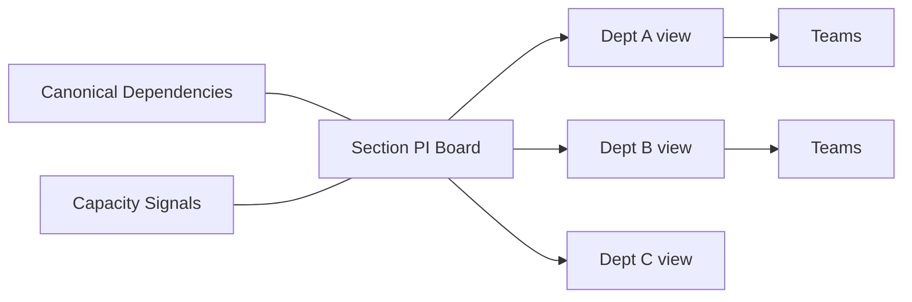

# PI Planning Model

**Status:** Confirmed conceptual planning model  
**Related:** Domain Model, Capacity, Dependencies, Baselines, UX

---

## 1. Purpose

Define multi-department PI Planning as a first-class capability that supports allocation, capacity problem detection, dependencies, and baselines—not only a static board view.

---

## 2. Confirmed Context

Multiple departments within a section plan together.

Planning hierarchy drill-down:

```text
Section
  → Department
    → Team
      → Resource
```

Moving work must eventually trigger recalculation of relevant planning information (load, utilization, conflicts).

---

## 3. Core Entities

### 3.1 PI (Planning Increment)

| Field (conceptual) | Notes |
|---|---|
| PI ID / name | |
| Time range | Start/end |
| Status | Draft planning / in review / baselined / active / closed |
| Participating departments | Explicit set |
| Objectives | Optional structured objectives |

### 3.2 Iteration / Timebox

Subdivisions of a PI used for capacity and allocation.

### 3.3 Backlog / Work Items

Plannable units originating from projects/initiatives/delivery backlog.

### 3.4 Allocation

Assignment of work to team and/or resource within a timebox, with load estimates.

### 3.5 Capacity Plan

| Dimension | Notes |
|---|---|
| Team capacity | Per timebox |
| Resource capacity | Per timebox |
| Availability | Derived from availability windows |
| Planned load | Sum of allocations |
| Utilization | Load / capacity |
| Overload | Load > capacity (threshold configurable) |
| Under-allocation | Load materially below capacity (threshold configurable) |

### 3.6 Dependency (canonical)

See §6 — single source of truth.

### 3.7 Planning Conflict

System-detected problem record (overload, missing dependency timing, double-booking, unresolved critical dependency, etc.).

### 3.8 Baseline / Snapshot

Immutable planning snapshot for review/approval/compare. See [AUDIT-AND-BASELINES.md](./AUDIT-AND-BASELINES.md).

---

## 4. Required Capabilities (Product Direction)

| Capability | Notes |
|---|---|
| PI definition | Confirmed |
| Iterations/timeboxes | Confirmed |
| Department/team views | Confirmed |
| Project/work backlog | Confirmed |
| Drag-and-drop planning | Confirmed direction; UX in later implementation |
| Allocation | Confirmed |
| Capacity | Confirmed |
| Overload detection | Confirmed |
| Dependencies | Confirmed |
| Milestones | Canonical links |
| Risks | Canonical links |
| Planning conflicts | Confirmed |
| Filters | Confirmed |
| Overall view + drill-down | Confirmed |
| Baselines/snapshots | Confirmed |

---

## 5. Capacity Problem Detection

### Confirmed

The system must **identify planning problems**, not only display capacity numbers.

Examples of detectable problems:

- team overload in an iteration
- resource overload
- allocation without capacity baseline
- under-allocation where capacity was reserved (**Open:** whether under-allocation is MVP)
- work scheduled after needed-by dependency date
- cross-department dependency with no owning resolution plan

Conflicts should appear in:

- planning board signals
- department views
- executive attention queue (for critical ones)

---

## 6. Dependencies

### Confirmed

Dependencies are first-class entities with one source of truth.

Eventual relationship types:

- project → project
- work item → work item
- department → department impact
- cross-team dependencies

Attributes direction:

- status
- owner
- needed-by date
- risk/criticality
- resolution

**Forbidden pattern:** copying independent dependency rows into each module for display. Modules may **project/read** the canonical dependency.

---

## 7. Recalculation Semantics

### Recommendation

When allocations move (iteration, team, estimate changes):

1. Recalculate affected capacity aggregates.
2. Re-evaluate conflict detectors for affected scopes.
3. Mark planning draft as dirty relative to last baseline.
4. Emit audit for material planning changes (threshold policy configurable).

Exact synchronous vs asynchronous recalculation is an implementation decision; UX must not show stale overload as healthy without indication.

---

## 8. Multi-Department Collaboration



Senior/section views see cross-department load and critical dependencies; department managers see scoped edit rights with cross-dept read as permitted by policy.

---

## 9. Baseline States (Planning)

Conceptual states:

| State | Meaning |
|---|---|
| Draft planning | Mutable working plan |
| Management Review | Frozen or controlled review candidate |
| Approved Baseline | Reproducible approved snapshot |
| Actual / current | Live execution state progressing after baseline |

Comparing current vs baseline supports “what changed?”

---

## 10. MVP vs Later (Planning Slice)

| MVP | Next | Later |
|---|---|---|
| PI + iterations | Drag-and-drop polish | Advanced scenario planning |
| Manual allocation | Auto-suggestions | Optimization solvers |
| Team capacity | Rich resource calendars | Skills-based allocation engine |
| Overload detection | Under-allocation policies | Predictive capacity |
| Canonical dependencies | Dependency graph UX | External system sync |
| Snapshot baseline | Multi-baseline compare UX | What-if branches |

See [MVP-ROADMAP.md](./MVP-ROADMAP.md).

---

## 11. Permissions

| Action | Direction |
|---|---|
| Edit allocation in own department | Department planning capability |
| View cross-department plan | Section/senior read capability |
| Approve planning baseline | Governance capability |
| Resolve critical dependency | Owner + scoped managers |

---

## 12. Edge Cases

| Case | Direction |
|---|---|
| Department joins PI late | Participating set is mutable with audit |
| Work spans iterations | Supported via split allocation or multi-iteration links (**Open** exact model) |
| Resource shared across teams | Capacity must not be double-counted incorrectly |
| Partial baseline approval | **Open**; MVP may require whole-PI baseline |

---

## 13. Acceptance Criteria

- Multi-department PI Planning defined.
- Capacity + overload detection defined.
- Dependency single-source rule stated.
- Drill-down hierarchy defined.
- Baseline semantics referenced.
- Recalculation expectation stated.
- MVP cuts clear.

---

## 14. Non-Goals

- Replacing specialized agile toolchains for every team ceremony in MVP.
- Hardcoding a specific PI calendar for one company.
- Implementing Excel import of PI sheets in Phase 0.
