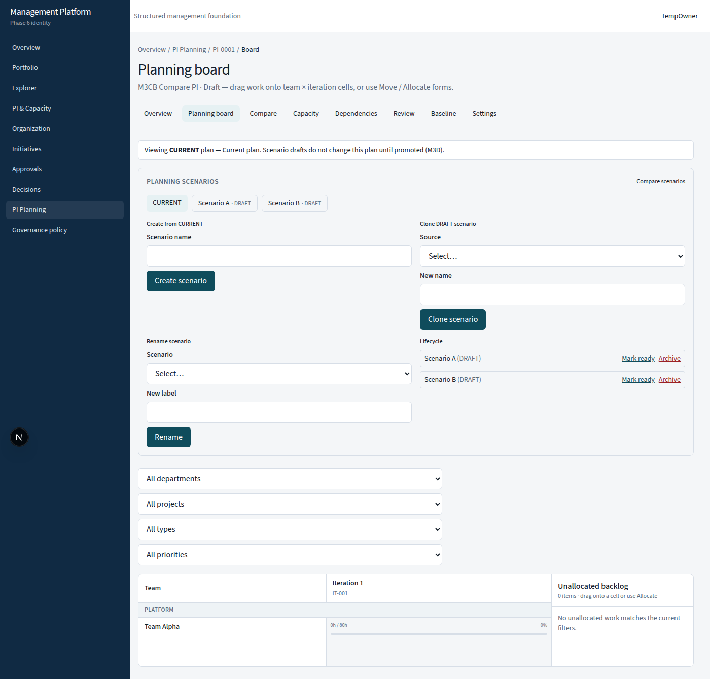
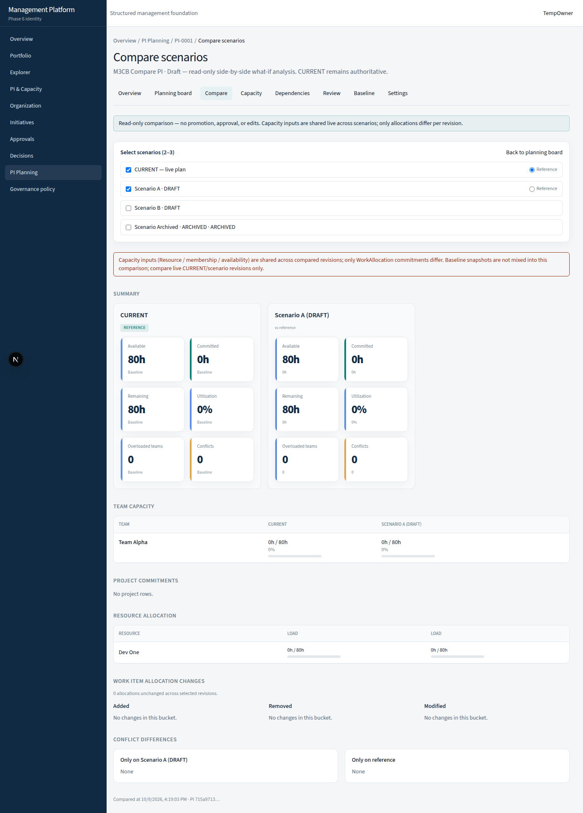
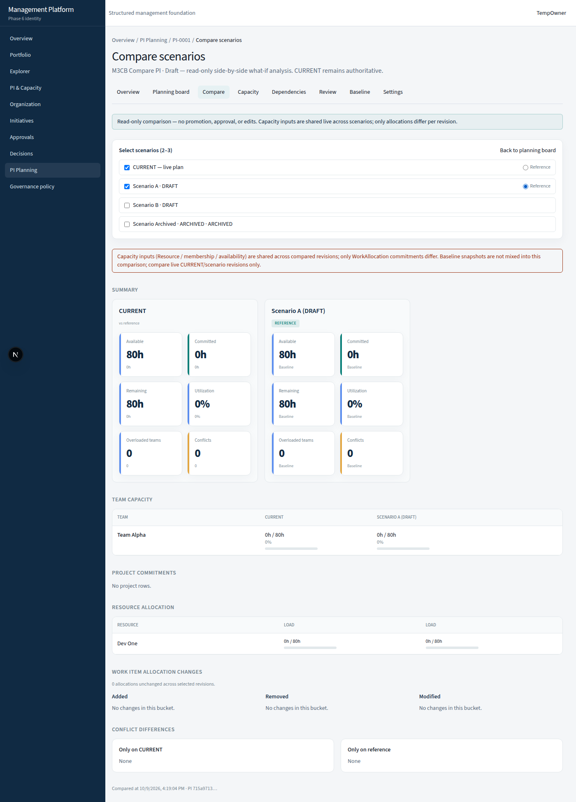
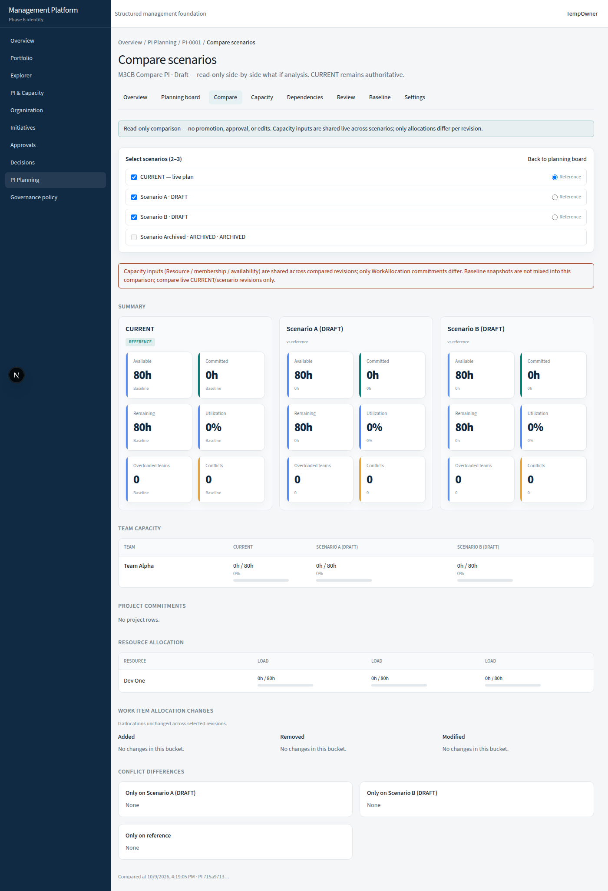
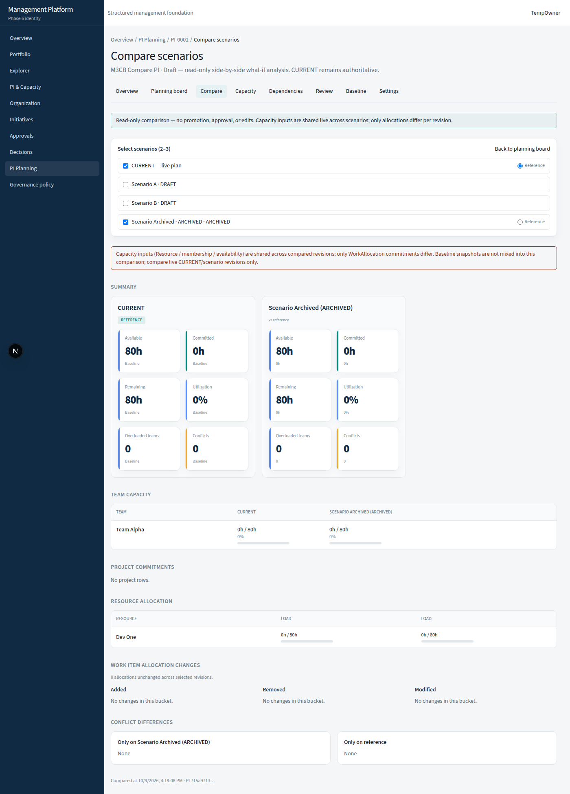
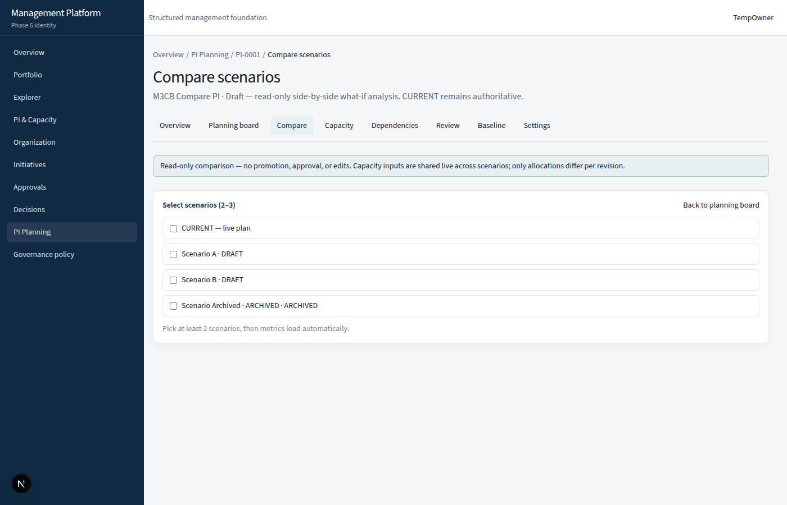
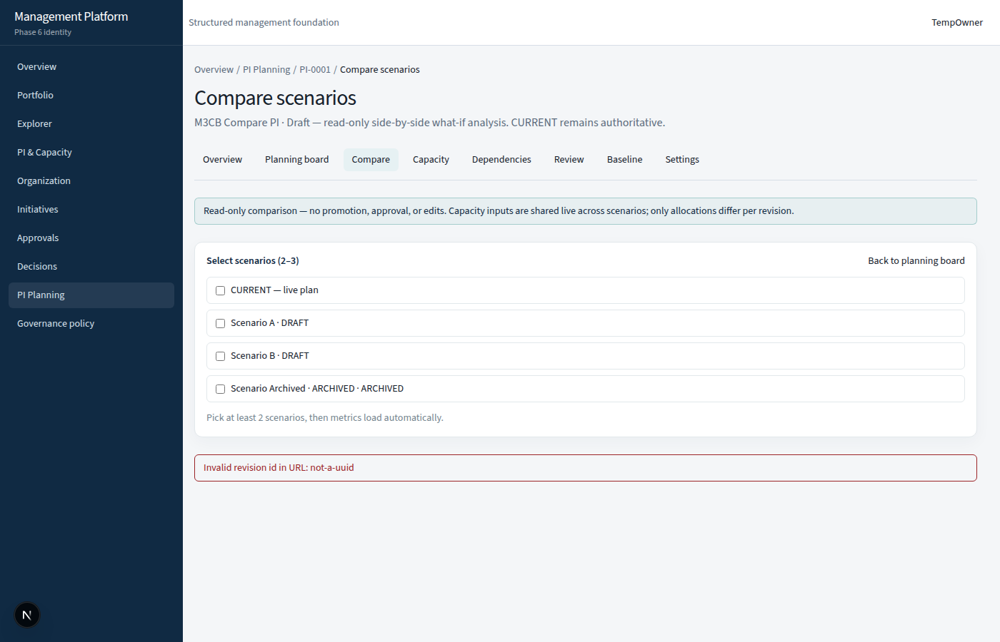
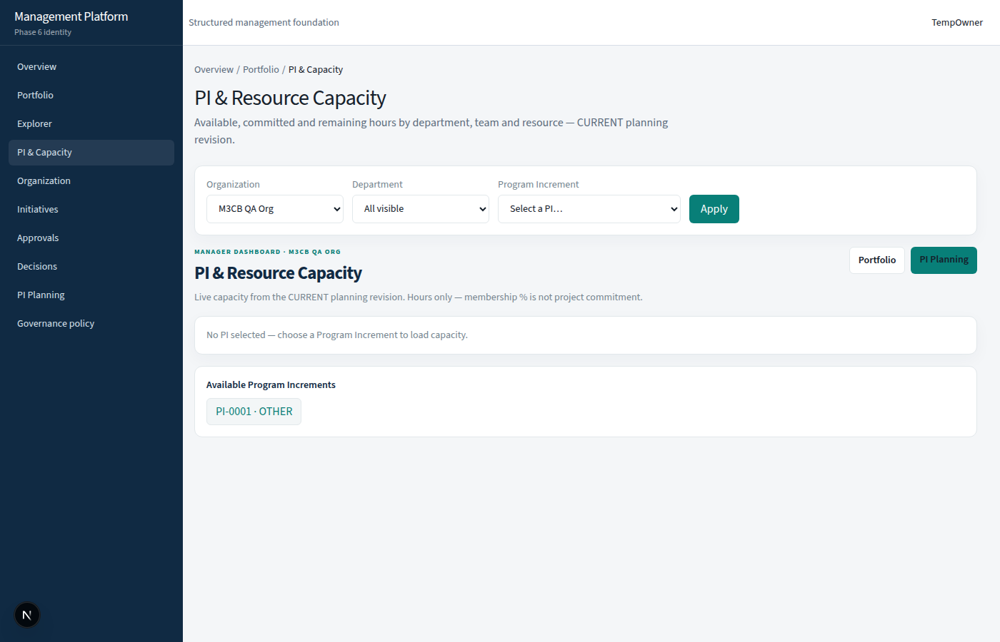
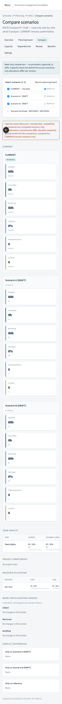

# PI Scenario Comparison — Final Acceptance (M3C-C)

**Status:** PASS  
**Date:** 2026-10-09  
**Starting main SHA:** `248e83bf46d7940cf8f0fbec6f0e558093851d14`  
**Scope:** Verification only — M3B + M3C-A + M3C-B. **No M3D.**

Related:

- [PI-SCENARIO-COMPARISON-CONTRACT.md](./PI-SCENARIO-COMPARISON-CONTRACT.md) (M3C-A)
- [PROJECT-PLATFORM-M3-SCENARIO-ARCHITECTURE.md](./PROJECT-PLATFORM-M3-SCENARIO-ARCHITECTURE.md)

---

## 1. Baseline verification

| Check | Result |
|---|---|
| `origin/main` contains M3C-B SHA `248e83b…` | PASS |
| M3B migration `20261009150000_m3b_planning_scenarios` present | PASS |
| M3C-A `compareScenarios` + contract doc present | PASS |
| M3C-B route `/pi/[piId]/compare` present | PASS |
| Working tree clean for tracked sources (artifacts local-only) | PASS |

---

## 2. Acceptance matrix

Evidence sources:

- **INT** — `tests/integration/pi-scenario-comparison-m3c.test.ts` (DB `management_platform_m3c_int`)
- **M3B** — `tests/integration/pi-scenarios-m3b.test.ts`
- **UNIT** — `tests/unit/scenario-comparison-display.test.ts`
- **ISO** — `scripts/m3cc-acceptance-evidence.mts` → `artifacts/m3cc-acceptance/isolation-evidence.json`
- **UI** — Playwright `scripts/m3cc-browser-qa.mjs` → `artifacts/m3cc-acceptance/`

| # | Scenario | Result | Evidence |
|---|---|---|---|
| 1 | CURRENT vs Scenario A | PASS | INT hour/project deltas; UI two-way screenshot |
| 2 | CURRENT vs Scenario A/B (three-way) | PASS | INT three-revision; UI three-way screenshot |
| 3 | Scenario A vs Scenario B | PASS | INT draft-vs-draft; ISO `aVsB` committed 16→32 |
| 4 | Archived scenario comparison | PASS | INT archived compare; UI archived screenshot |
| 5 | Added / removed / modified allocations | PASS | INT add/remove/placement; ISO threeWay added=1 changed=1 |
| 6 | Iteration placement changes | PASS | INT `placement_changed` / `hours_and_placement_changed` |
| 7 | Available / committed / remaining hours | PASS | INT + ISO totals; UI KPI cards |
| 8 | Utilization and overloaded teams | PASS | INT overload detection; UI KPI cards |
| 9 | Project commitment differences | PASS | INT project deltas; ISO `projectDeltas` +16h |
| 10 | Resource allocation differences | PASS | INT resource rows; UI resource table |
| 11 | Conflict differences | PASS | INT conflict buckets; UI conflict sections |
| 12 | Shared Resource capacity (no double-count) | PASS | INT shared available hours across revisions |
| 13 | Unavailable versus zero | PASS | UNIT `formatUtilizationPercent(null)` → `—`; UI uses em dash for null util |
| 14 | Invalid / cross-PI revision rejection | PASS | INT cross-PI `NOT_FOUND`; UI invalid UUID error |
| 15 | Viewer read-only + cross-org denial | PASS | INT viewer OK; stranger denied; ISO auth |

---

## 3. Database isolation evidence

Fixture DB: `management_platform_m3c_int` (isolated from browser QA).

Script: `npx tsx scripts/m3cc-acceptance-evidence.mts`

| Assertion | Result |
|---|---|
| SHA-256 of allocations + revisions + baselines **unchanged** across three `compareScenarios` calls | PASS (`cf9bec5b…` before = after) |
| `PiBaseline.payload` unchanged | PASS |
| Edit Scenario B hours (24→30) leaves CURRENT allocations unchanged | PASS |
| Edit Scenario B leaves Scenario A allocations unchanged | PASS |
| Portfolio PI capacity remains `meta.revision.isCurrent === true` with CURRENT committed hours (16) | PASS |
| No write path in comparison service (contract + INT immutability test) | PASS |

Raw JSON: [`docs/acceptance-assets/m3cc/isolation-evidence.json`](./acceptance-assets/m3cc/isolation-evidence.json)

M3B regression also proves Scenario B board edits do not mutate Scenario A or CURRENT (`pi-scenarios-m3b.test.ts` isolation suite).

---

## 4. Authorization results

| Case | Expected | Result |
|---|---|---|
| Viewer with org `PI_VIEW` | Compare succeeds (read-only) | PASS |
| Principal with no org binding | Denied | PASS |
| Cross-PI revision ids | `NOT_FOUND` | PASS |
| Cross-organization PI | Denied | PASS |
| UI resource filtering only in React | Not used — server returns scoped rows | PASS |

---

## 5. Browser QA

Stable browser database: Prisma-hosted QA DB (separate from `*_int` fixture DBs).  
Seed: `scripts/seed-m3cb-browser-qa.mts` (idempotent; includes archived scenario).  
Runner: `scripts/m3cc-browser-qa.mjs` against `http://localhost:43147`.

| Step | Result |
|---|---|
| Login | PASS |
| PI Planning → Compare nav | PASS |
| Two-scenario comparison | PASS |
| Reference scenario selection | PASS |
| Three-scenario comparison | PASS |
| Scenario B board context + refresh compare | PASS |
| Archived scenario compare | PASS |
| Empty selection state | PASS |
| Invalid revision error | PASS |
| Back to planning board | PASS |
| Portfolio capacity page loads (CURRENT path) | PASS |
| Mobile layout (390×844) | PASS |

**13/13 steps PASS.** Result JSON: [`docs/acceptance-assets/m3cc/browser-qa-result.json`](./acceptance-assets/m3cc/browser-qa-result.json)

### Screenshots

| Asset | Description |
|---|---|
|  | Planning board with Compare tab / link |
|  | CURRENT vs Scenario A |
|  | Reference switched to Scenario A |
|  | CURRENT + A + B |
|  | CURRENT vs archived |
|  | Empty selection prompt |
|  | Invalid revision URL error |
|  | Back to planning board |
|  | Portfolio capacity |
|  | Mobile three-way layout |

Note: Browser seed scenarios start with zero committed allocations, so UI deltas are often `0`. Non-zero metric/delta correctness is covered by INT/ISO fixtures above.

---

## 6. UX findings (no redesign in M3C-C)

| Question | Finding | Severity |
|---|---|---|
| Distinguish CURRENT from drafts? | Yes — “CURRENT — live plan”, status badges `(DRAFT)` / `(ARCHIVED)`, teal **Reference** chip | OK |
| Are differences understandable? | KPI cards + Δ vs reference + Added/Removed/Modified buckets are clear for planners | OK |
| Negative capacity / remaining? | Remaining can go negative mathematically; UI formats hours with sign via deltas. No plain-language callout explaining “over-committed” beyond overload band/conflicts | Minor |
| Best trade-off without technical knowledge? | Side-by-side KPIs support trade-offs; empty project/work buckets when no allocations reduce signal. No ranking/score (by design) | OK / product note |
| Navigation intuitive? | Compare tab + board “Compare scenarios” link + “Back to planning board” | OK |
| Excessive clicks? | Selecting 2–3 scenarios + optional reference radio is minimal; URL preserves state | OK |
| Accessibility | Checkboxes/radios have aria-labels; headings structure sections. Tables are wide — horizontal scroll on mobile | Minor |
| Read-only clarity | Persistent banner forbids promotion/approval/edits | OK |

**UX backlog (out of scope for M3C-C):** explain over-commit remaining hours in plain language; optional seed sample allocations in browser demo data for richer visual deltas.

---

## 7. Regression / quality gates

| Gate | Result |
|---|---|
| `npm run typecheck` | PASS |
| `npm run lint` | PASS |
| `npm test` | **147** passed / 20 files |
| `npm run test:integration` | **174** passed / 16 files |
| `npm run build` | PASS |
| `npx prisma migrate status` | Database schema up to date (11 migrations) |

Coverage includes identity/RBAC, ownership, governance, project delivery/closure, PI planning, Portfolio M2, M3B scenarios, M3C comparison.

---

## 8. Defects

| ID | Severity | Description | Disposition |
|---|---|---|---|
| — | — | No blocking defects found in M3C acceptance | N/A |

Known limitations (accepted):

1. Comparison does not time-travel membership/availability (`asOf` is metadata only) — per M3C-A contract.
2. Baselines are not comparable sides — dirty-vs-baseline remains separate APIs.
3. Browser QA seed uses empty allocations; visual non-zero deltas rely on INT/ISO.
4. M3D promotion / selection / baseline-from-scenario **not implemented** (by design).

---

## 9. Verdict

**M3C COMPLETE — READY FOR M3D SCENARIO SELECTION & BASELINE**

All acceptance scenarios, isolation proofs, authorization checks, browser QA, and quality gates passed. No UI redesign performed in this phase.
