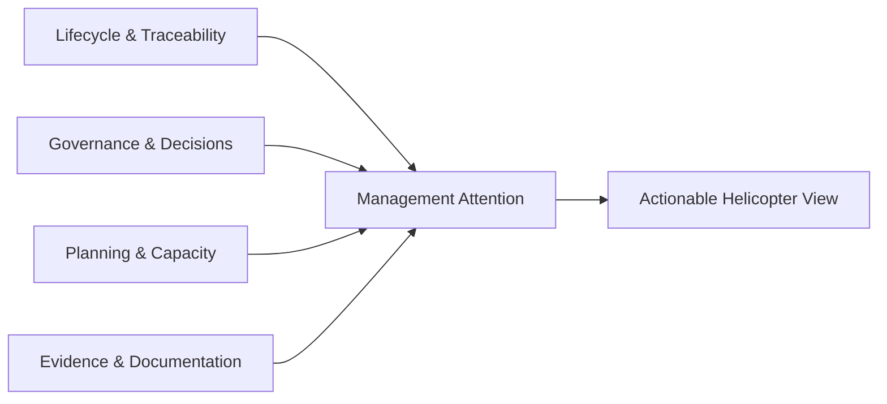

# Product Vision

**Status:** Confirmed product direction (Phase 0)  
**Audience:** Product owners, architects, implementers, reviewers

---

## 1. Purpose

Define why the Management & PI Planning Platform exists, who it serves, and what “success” means for both operational managers and senior managers.

This document does **not** specify implementation details. See [ARCHITECTURE.md](./ARCHITECTURE.md) and [MVP-ROADMAP.md](./MVP-ROADMAP.md).

---

## 2. Problem Statement

### Confirmed

A section containing multiple departments currently plans and governs work using fragmented Excel-based processes. Information about:

- initiatives and their lifecycle stage;
- requirements and evidence;
- approvals and decisions;
- capacity and overload;
- dependencies and blockers;
- costs/budgets;
- portfolio health;

is scattered across spreadsheets, local files, and informal communication.

Consequences:

- Senior managers lack a reliable helicopter view.
- Decisions and approvals are hard to reconstruct.
- Overload and critical dependencies surface late.
- Traceability from demand to delivery is weak or manual.
- Stage progress is often a status label without governed evidence.

### Non-goals of this vision statement

- Replacing every enterprise system (ERP, HRIS, full finance ledger).
- Automating governance decisions without human authority.
- Being only a task tracker or only a PI Planning board.

---

## 3. Product Intent

### Confirmed

Build a structured **management, governance, portfolio, and PI Planning platform** that replaces fragmented spreadsheet planning for a multi-department section.

The platform must:

1. Support end-to-end initiative lifecycle (idea → delivery), with stages as rich contexts—not mere status strings.
2. Make **management attention and decisions visible**.
3. Support operational planning (teams, capacity, work, dependencies).
4. Support senior management oversight (“what needs my attention?”).
5. Preserve auditability, traceability, and baselines.
6. Remain configurable over time (workflows, evidence packages, decision types, categories).

### Core principle

> The system must not merely display data. It must make management attention and decisions visible.

---

## 4. Primary Users

### Confirmed user classes (conceptual)

| User class | Primary need |
|---|---|
| Operational / Department Manager | Plan and run work for their area; manage capacity, initiatives, and local decisions |
| Team Lead / Contributor | Maintain work, requirements, documents, evidence within scoped permissions |
| Approver / Governance Participant | Review evidence and approve/reject/request-changes at gates |
| Senior / Section Manager | Helicopter view: attention items, risks, overload, spend, pending decisions |
| Platform Administrator | Configure org structure, roles, workflow/governance parameters (no hardcoded identities) |

### Explicit constraint

User classes above are **capability patterns**, not hardcoded role names or seeded accounts. Authorization must remain flexible. See [ROLES-AND-PERMISSIONS.md](./ROLES-AND-PERMISSIONS.md).

---

## 5. Organizational Context

### Confirmed hierarchy (initial conceptual model)

```text
Organization
  → Section
    → Department
      → Team
        → Resource
```

Departments within a section plan together (especially during PI Planning).

Resources are capacity-bearing entities (typically people, but the domain must remain extensible to other capacity units). See [DOMAIN-MODEL.md](./DOMAIN-MODEL.md).

---

## 6. Value Proposition

### For operational managers

- One structured place for demand, requirements, pre-study, PoC, Pilot, project, and PI Planning.
- Clear ownership, blockers, capacity load, and next actions.
- Less spreadsheet reconciliation across departments.

### For senior managers

Answer, without navigating hundreds of tasks:

| Question | Platform response concept |
|---|---|
| What is happening? | Portfolio and lifecycle overview |
| What requires my attention? | Attention queue (approvals, decisions, overloads, risks) |
| What decisions are waiting? | Pending decision records |
| Where are we overloaded? | Capacity signals and conflicts |
| What is blocked? | Critical unresolved dependencies / blockers |
| What is at risk? | Risk and variance views |
| What are we spending? | Budget / forecast / variance (MVP-light) |
| What are our critical dependencies? | Cross-department dependency view |
| What changed? | Changes since baseline / audit-significant deltas |

### For the organization

- Auditable governance (approvals, decisions, document versions, baselines).
- Traceability from business need through delivery.
- Controlled stage transitions (including auditable stage skips).

---

## 7. Product Pillars



1. **Lifecycle & Traceability** — initiatives progress through governed stages with preserved history.
2. **Governance & Decisions** — approvals and decisions are first-class, auditable records.
3. **Planning & Capacity** — multi-department PI Planning with overload and conflict detection.
4. **Evidence & Documentation** — Documentation Hub and evidence packages feed gates.
5. **Management Attention** — dashboards prioritize what needs action, with drill-down.

---

## 8. Experience Ambition

### Confirmed UX intent

This is software for **managers**, not only PM tool experts.

The product must emphasize:

- clear hierarchy;
- low cognitive load;
- progressive disclosure;
- actionable dashboards;
- clear current stage and next action;
- clear ownership;
- visible blockers, pending approvals, and decisions;
- drill-down from helicopter view to detail.

Canonical entities (milestones, dependencies, decisions, documents) have one ownership location and appear contextually elsewhere. See [UX-PRINCIPLES.md](./UX-PRINCIPLES.md).

---

## 9. Success Criteria (Product Level)

### Confirmed directional success measures

The platform is succeeding when:

1. A department can run demand → governed stage progression → project without Excel as the system of record.
2. A senior manager can identify attention items and drill into them without scanning all tasks.
3. An auditor/reviewer can reconstruct who approved/decided what, on which version/evidence, and when.
4. Multi-department PI Planning can show capacity conflicts and critical dependencies from one source of truth.
5. The system operates without hardcoded business identities or seed data as a runtime dependency.

### Open

Quantitative adoption KPIs (e.g., spreadsheet reduction targets, time-to-decision) are **Open** until stakeholders define measurement baselines.

---

## 10. Relationship to Excel

### Confirmed

Excel is the current process substrate. The platform should eventually support structured import (mapping, preview, validation, reusable mappings). Import is **not** implemented in Phase 0. See [EXCEL-MIGRATION.md](./EXCEL-MIGRATION.md).

The long-term goal is replacement of fragmented planning spreadsheets as the system of record—not merely mirroring Excel screens.

---

## 11. Technical Direction (Vision-Level Only)

### Recommendation

Initial delivery path: GitHub → Vercel, with Next.js / React / TypeScript / PostgreSQL / typed persistence / Tailwind / standards-based auth / server-side authorization.

### Confirmed constraints

- Do not couple domain logic to Vercel.
- Keep the application portable to other deployment environments.
- Prefer a modular monolith for the first implementation.
- No scaffolding in Phase 0.

Details: [ARCHITECTURE.md](./ARCHITECTURE.md).

---

## 12. Explicit Vision Non-Goals

- Autonomous decision-making by the system.
- Full financial ERP replacement.
- Hardcoded demo tenants as production prerequisites.
- Microservices-first architecture for v1.
- Implementing advanced configurable workflow engine in MVP (design for it; ship a constrained governed path first).

---

## 13. Open Questions

See [OPEN-QUESTIONS.md](./OPEN-QUESTIONS.md) for the living list. Vision-level opens include:

- Exact section/organization cardinality for first production tenant(s).
- Whether multi-tenant SaaS is required for v1 or single-organization deployment is sufficient.
- Authority model for cross-department approvals in the first real org.
