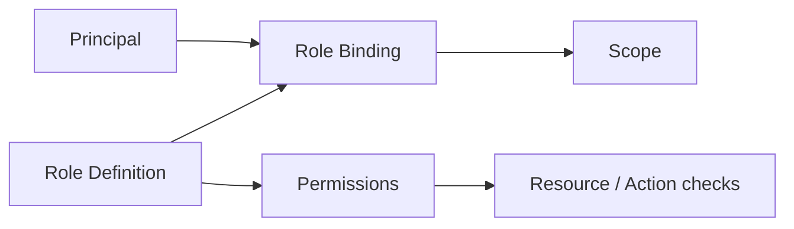

# Roles and Permissions

**Status:** Confirmed authorization direction  
**Related:** Domain Model, Governance, Architecture, UX

---

## 1. Purpose

Define a **flexible, scoped authorization model** for the platform without hardcoding users, departments, or person-specific role assignments into application logic.

---

## 2. Confirmed Requirements

1. Access must be scoped (e.g., own department vs cross-department).
2. Capability patterns include managers, senior/section visibility, contributors, approvers, administrators.
3. These patterns are **examples of needs**, not mandatory fixed role names hardwired into business rules.
4. Authorization is enforced **server-side**.
5. No special-cased hardcoded identities (no built-in “admin@example.com”, no seeded real people).
6. Permission and role-binding changes are auditable.

---

## 3. Conceptual Model

| Concept | Meaning |
|---|---|
| **Principal** | Authenticated identity |
| **Permission** | Atomic action on a resource type (e.g., `initiative.transition`, `approval.decide`) |
| **Role Definition** | Named set of permissions (configurable per organization) |
| **Scope** | Boundary: Organization / Section / Department / Team / Initiative / PI / … |
| **Role Binding** | Principal + Role Definition + Scope (+ effective dates) |

---

## 4. Scope Levels (Initial)

| Scope | Typical use |
|---|---|
| Organization | Admin configuration, org-wide read (rare) |
| Section | Senior manager helicopter view; cross-department planning |
| Department | Department manager operational control |
| Team | Team-level planning/edit |
| Initiative | Contributors on a specific initiative |
| Gate / Decision | Approver authority for specific governance actions |

Scopes are hierarchical for **read inheritance recommendations** (child visible if parent granted), but write privileges should be explicit. Exact inheritance rules are an architectural decision to lock in implementation (**Recommendation:** deny-by-default; grant explicit; optional read cascade).

---

## 5. Capability Patterns (Non-Hardcoded Examples)

These describe product needs. Organizations may name roles differently.

| Pattern | Intended capabilities (examples) |
|---|---|
| Contributor | Create/edit drafts, requirements, comments within scope |
| Department Manager | Manage department initiatives, allocations, local approvals as configured |
| Section / Senior Manager | Cross-department visibility; attention queue; certain gate authorities |
| Approver | Decide approval slots matching authority attributes |
| Decision Authority | Record decisions for given decision types/scopes |
| Governance Admin | Configure gates, evidence packages, option sets |
| Platform Admin | Org structure, role definitions, bindings, auth settings |
| Auditor (Future) | Read-only access to audit and historical baselines |

**Confirmed:** Do not implement product features that only work if a specific named role string exists, unless that string is configuration.

---

## 6. Authorization Boundaries

### Confirmed

| Boundary | Rule |
|---|---|
| API / server actions | Every mutating and sensitive read path checks authZ |
| UI | May hide actions for UX; never sole control |
| Domain services | Perform authZ checks at application service edge (recommendation) |
| Reporting | Respect scopes; no leak via “export all” |

### Attribute-based extensions (Future-friendly)

Policies may need attributes beyond role names:

- cost threshold triggers finance approver slot
- data classification triggers privacy slot

Design permissions/policy engine to allow attributes later without rewriting domain entities. Full ABAC engine is **not** MVP-required; model should not preclude it.

---

## 7. Bootstrap Problem (Empty System)

### Confirmed constraint

The app must not ship with fake departments/users as production prerequisites.

### Recommendation for first-run

1. Deployment-time bootstrap creates an empty Organization.
2. A **one-time bootstrap admin binding** is created via secure environment/ops process (not hardcoded identity in source).
3. Bootstrap admin configures org structure and role bindings.
4. Bootstrap path is audited and can be disabled after initial setup.

Exact bootstrap UX is **Open**.

---

## 8. Governance Authorities vs Org Roles

Approver slots reference **required authority** (capability/attribute), which may be satisfied by:

- a role binding in scope, and/or
- an explicit principal assignment on the approval request

Do not assume “Department Manager” string is universal.

---

## 9. Permission Catalog (Illustrative Starting Set)

Illustrative only — final catalog during implementation:

- `org.configure`
- `org.structure.manage`
- `role.manage`
- `initiative.read` / `initiative.write` / `initiative.transition`
- `requirement.manage`
- `document.manage` / `document.approve`
- `approval.decide`
- `decision.record`
- `project.manage`
- `pi.plan.edit` / `pi.baseline.approve`
- `capacity.view`
- `dependency.manage`
- `audit.read`
- `attention.view`

Permissions should be stable IDs; display labels can be localized later.

---

## 10. Edge Cases

| Case | Direction |
|---|---|
| Principal in multiple departments | Bindings per scope; avoid implicit global write |
| Temporary delegation | Future; model with time-bound bindings |
| Removed from department while owning drafts | Retain historical authorship; new edits may revoke |
| Cross-department initiative | Explicit participating departments + scoped grants |

---

## 11. Acceptance Criteria

- Scoped RBAC (with future ABAC openness) defined.
- No hardcoded identities/business data.
- Server-side enforcement required.
- Capability patterns documented as examples.
- Bootstrap approach recommended without seed fake org chart.
- Role-binding changes auditable.

---

## 12. Non-Goals

- Implementing OAuth provider specifics in Phase 0.
- Shipping a complex visual policy designer in MVP.
- Encoding one company’s AD group names as constants.
