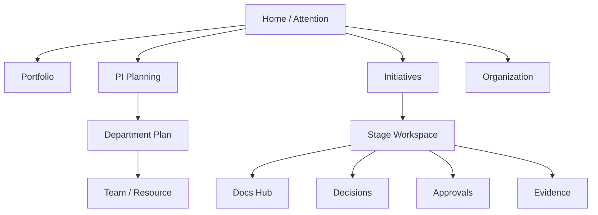

# UX Principles

**Status:** Confirmed UX direction  
**Audience:** Product, design, engineering

---

## 1. Purpose

Define UX principles for a platform used by **managers**, not only project-management tool experts. Emphasize clarity, attention, ownership, and drill-down—not feature sprawl.

---

## 2. Confirmed Principles

### 2.1 Clear hierarchy

Navigation and information architecture should reflect:

Organization → Section → Department → Team → Resource  
and  
Initiative → Stage → Evidence/Docs/Decisions/Work

Users should always know where they are in org and lifecycle context.

### 2.2 Low cognitive load

Prefer fewer simultaneous concepts on a screen. Avoid dashboard-of-dashboards on first view for operational flows.

### 2.3 Progressive disclosure

Helicopter view first; details on demand. Do not force senior managers through task boards to answer attention questions.

### 2.4 Actionable dashboards

Every attention item should lead to a next action (approve, decide, resolve dependency, review overload, open missing evidence).

### 2.5 Understandable terminology

Use business language aligned with the glossary. Avoid exposing internal schema names.

### 2.6 Clear current lifecycle stage

Initiative pages must show current stage, gate status, and blocked reasons prominently.

### 2.7 Clear next action

If a user can act, the primary next action should be obvious. If waiting on others, show who/what is pending.

### 2.8 Clear ownership

Owners visible for initiatives, stages, decisions, dependencies, documents.

### 2.9 Visible blockers, approvals, decisions

These are first-class UI signals—not buried tabs only.

### 2.10 Consistent navigation

Same entities reachable via consistent patterns (hub pages + contextual side panels/links).

### 2.11 Drill-down from helicopter to detail

Executive cockpit → entity → stage/decision/document. Do not duplicate every detailed screen inside the cockpit.

### 2.12 Canonical ownership of concepts

Milestones, dependencies, decisions, documents have one home and appear contextually elsewhere.

---

## 3. Executive / Senior Management Experience

### Confirmed attention questions

The cockpit prioritizes answering:

- What is happening?
- What requires my attention?
- What decisions are waiting?
- Where are we overloaded?
- What is blocked?
- What is at risk?
- What are we spending?
- What are our critical dependencies?
- What changed?

### Attention item examples

- approval waiting
- decision required
- overloaded team
- unresolved critical dependency
- overdue milestone
- missing evidence
- budget variance
- initiative stuck in stage

### Confirmed portfolio widgets (direction)

- Portfolio health
- Capacity
- Budget (light)
- Critical dependencies
- Risks
- Milestones
- Pending approvals
- Pending decisions
- Overdue actions
- Initiatives by lifecycle stage
- Changes since baseline

---

## 4. Operational Manager Experience

Focus surfaces:

1. My department initiatives by stage
2. Capacity & overload
3. PI Planning for my teams
4. Pending approvals/decisions in my authority
5. Documentation Hub per initiative
6. Requirements and evidence readiness

---

## 5. Information Architecture Guidelines

**Recommendation:** Global search later; MVP can use scoped lists + filters.

---

## 6. Interaction Rules

| Rule | Rationale |
|---|---|
| Don’t use status color alone | Accessibility + clarity |
| Distinguish Recommendation vs Decision visually | Prevent governance errors |
| Distinguish PoC vs Pilot labels/contexts | Prevent concept collapse |
| Show version IDs when approving documents | Version integrity |
| Confirm destructive/governance actions | Audit-critical paths |
| Empty states teach setup | No fake data; guide configuration |

---

## 7. Empty System UX

Because hardcoded business data is forbidden, empty states must:

- explain what to configure first (org structure, roles);
- avoid looking “broken”;
- never silently insert demo departments/projects.

---

## 8. Motion / Density (Recommendation)

Manager tools should prefer calm, readable density over marketing motion. Motion, if used, should clarify hierarchy or state change—not decorate.

Visual brand direction for marketing surfaces is out of scope for Phase 0 product docs; application chrome should prioritize clarity.

---

## 9. Acceptance Criteria

- Attention-first senior experience defined.
- Progressive disclosure and canonical ownership stated.
- Lifecycle stage + next action visibility required.
- Empty-state policy without fake data stated.
- PoC/Pilot and Recommendation/Decision UX distinctions required.

---

## 10. Non-Goals

- Pixel-perfect UI kit in Phase 0.
- Cloning Jira/Azure DevOps information architecture wholesale.
- Building separate apps per user class for v1 (one app, capability-scoped views).
